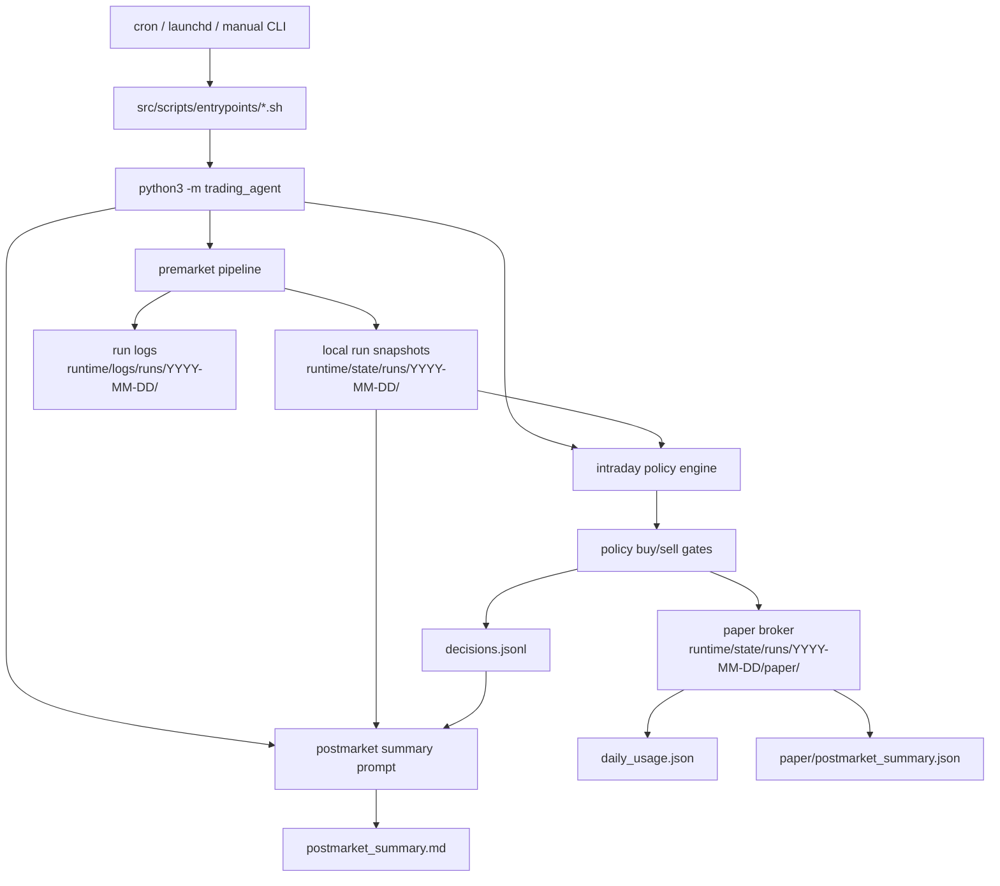
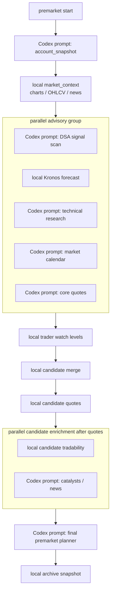

# Robinhood Codex Agent

Low-frequency trading automation for a dedicated Robinhood Agentic Account.

The system is intentionally conservative. Premarket uses Codex and Robinhood MCP to write local
snapshots and a daily plan. Intraday does not call Robinhood MCP directly; it reads those local
snapshots, runs a Python policy engine, and in paper mode updates a local simulated account.

Primary runtime entrypoints:

```bash
python3 -m trading_agent premarket
python3 -m trading_agent intraday
python3 -m trading_agent postmarket
```

Default state is deliberately safe:

- `TRADING_MODE=paper`
- `RISK_TIER=3`
- `PAPER_STARTING_CASH=400000`
- `CODEX_MODEL=gpt-5.4-mini`
- `KILL_SWITCH` exists
- generated state and logs are ignored by git
- intraday paper execution is wired through the Python policy engine and local paper broker
- intraday buy/sell decisions are gated by same-day technical price levels when available
- intraday review/live execution is not wired yet and fails closed with `execution_not_wired`
- real order placement tools are not auto-approved

This is automation infrastructure, not financial advice. Live trading can lose money. Keep this in
paper/review mode until the logs are boring and correct.

## System Diagram



Premarket is the only scheduled lifecycle phase that should collect account/quote/tradability data
from Robinhood MCP. Intraday consumes the files premarket wrote.

## Premarket DAG



Advisory failures are logged and fail closed where possible. The final planner is the official source
for `daily_plan.json`, `today_allowlist.txt`, `dynamic_allowlist.json`, and the reset
`daily_usage.json`.

## Package Architecture

```text
src/
  trading_agent/
    cli.py                   argparse entrypoint for premarket/intraday/postmarket
    core/                    runtime config, paths, time, JSON helpers, run logs
    orchestration/           lifecycle pipelines
      premarket.py           staged DAG with Codex prompts, local data, and archive
      intraday.py            Python policy engine runner; no direct Robinhood MCP calls
      postmarket.py          Codex summary runner
    prompts/                 Codex subprocess runner and runtime variable block
    policy/                  deterministic intraday buy/sell/risk/scoring logic
    paper/                   local paper broker and ledger updates
    planner/                 deterministic candidate snapshot, scoring, and risk helpers
    data/                    yfinance-backed market context and chart collection
    signals/                 Kronos and technical fallback payload helpers
    reporting/               premarket archive and postmarket report helpers
    contracts/               schema validators for generated payloads
```

Shell wrappers live in `src/scripts/`. They source `src/scripts/lib/common.sh`, load
`src/config/runtime.env` plus optional `src/config/runtime.env.local`, create the dated runtime folders, and
then call the Python package.

## Repository Layout

```text
src/config/
  allowlist.txt                  emergency fallback symbols
  policy_profiles.json           deterministic intraday policy profiles
  risk.md                        human-readable hard risk rules
  risk_tiers.json                machine-readable notional caps by tier
  runtime.env                    default mode, model, tier, layer flags
  runtime.env.local              local overrides, ignored by git
  runtime.env.local.example      local override template
  strategy.md                    trading and screening strategy
  universe.txt                   maximum candidate universe
  dsa_strategy_weights.json      DSA-inspired signal weights

src/prompts/
  signals/dsa_scan.txt
  technical/research.txt
  premarket/account_snapshot.txt
  premarket/market_calendar.txt
  premarket/quote_snapshot_core.txt
  premarket/quote_snapshot_candidates.txt
  premarket/tradability_candidates.txt
  premarket/catalyst_enrichment.txt
  premarket/final_research.txt
  intraday/check.txt             legacy prompt/spec reference; Python policy is active path
  postmarket/summary.txt

src/scripts/
  lib/common.sh                  shared shell runtime
  entrypoints/                   scheduled lifecycle wrappers
  data/                          market feed and manual research helpers
  kronos/                        portable Kronos setup and runner
  safety/check_safety.sh         local safety sanity checks
  skills/                        repo-owned skill install/verify helpers

docs/
  setup/                         setup notes
  superpowers/specs/             design specs
  superpowers/plans/             implementation plans

runtime/state/
  runs/YYYY-MM-DD/               generated runtime state, ignored by git

runtime/logs/
  runs/YYYY-MM-DD/               generated runtime logs, ignored by git

launchd/
  *.plist.example                macOS LaunchAgent examples

cron.example                     cron schedule example
KILL_SWITCH                      default safety stop file
.codex/config.toml               project MCP approval policy
```

## Runtime State

Each run date uses the same folder shape:

```text
runtime/state/runs/YYYY-MM-DD/
  market_feed/
    manifest.json
    charts/
    ohlcv/
    news/
  signals/
    dsa_signals.json
    kronos_signals.json
    technical_signals.json
  planner/
    account_snapshot.json
    capital_snapshot.json
    market_calendar.json
    quote_snapshot_core.json
    candidate_snapshot.json
    candidate_scores.json
    quote_snapshot_candidates.json
    tradability_snapshot.json
    catalyst_snapshot.json
    trader_watch_levels.json
    data_status_summary.json
    risk_overlay.json
    today_allowlist.txt
    dynamic_allowlist.json
    daily_plan.json
    daily_plan.md
    daily_plan.zh.md
    daily_usage.json
  paper/
    day_start.json
    day_end.json
    equity_curve.jsonl
    postmarket_summary.json
    account.json
    positions.json
    orders.jsonl
  archive/
    premarket_report.json
```

```text
runtime/logs/runs/YYYY-MM-DD/
  pipeline/
    pipeline.jsonl
  progress/
    *.jsonl
  outputs/
    codex_runs.log
    stdout/
      *.log
    stderr/
      *.log
  system/
    errors.log
  audit/
    decisions.jsonl
    orders.jsonl
  reports/
    postmarket_summary.md
```

Important state contracts:

- `planner/account_snapshot.json` is the local account/positions/open-orders source created by the
  premarket account snapshot prompt.
- `planner/capital_snapshot.json` separates paper and real account capital. In paper mode, sizing
  uses the paper ledger or `PAPER_STARTING_CASH`; Robinhood buying power remains a read-only
  real-account reference.
- `planner/quote_snapshot_core.json` and `planner/quote_snapshot_candidates.json` provide intraday
  prices.
- `planner/trader_watch_levels.json` is a normalized, trader-facing copy of technical price levels:
  reference price, supports, resistances, entry zone, buy trigger, invalidation, targets,
  no-trade zone, and existing-long risk-reduction levels.
- `planner/data_status_summary.json` normalizes each layer's `ok`, `partial`, `failed`, or
  `missing` state with reason codes such as `market_closed`, `provider_partial`, `provider_failed`,
  `schema_invalid`, and `mcp_unavailable`.
- `planner/candidate_scores.json` deterministically aggregates existing DSA, Kronos, technical,
  quote, and catalyst outputs with transparent weights. It does not replace those reasoning layers.
  Technical actions are normalized before scoring so prompt-local values such as `strong_promote`,
  `promote`, `buy_bias`, `hold`, `observe`, `neutral`, `reduce`, `sell_bias`, `avoid`, and `block`
  land on one canonical scale instead of silently dropping to zero.
- `planner/risk_overlay.json` applies market-calendar, capital, risk-tier, account, and data-status
  gates before the final prompt writes narrative.
- `planner/daily_plan.json` inherits executable gating from `planner/risk_overlay.json`. A
  premarket run before the cash open is still valid; soft research partials lower confidence but do
  not become a standalone `no_trade` reason.
- `planner/daily_usage.json` starts from the final premarket planner and is updated by paper fills.
- `planner/daily_plan.zh.md` is the Chinese human-readable version of the premarket report.
- `paper/day_start.json`, `paper/day_end.json`, `paper/equity_curve.jsonl`, and
  `paper/postmarket_summary.json` are the visualization-friendly daily paper snapshots, equity
  curve, and postmarket paper performance summary.
- `paper/account.json`, `paper/positions.json`, and `paper/orders.jsonl` are the current simulated
  account ledger used only in `TRADING_MODE=paper`.
- `runtime/logs/runs/YYYY-MM-DD/progress/*.jsonl` records prompt-level progress. The Python runner
  always writes started/skipped/completed/failed records; long research prompts are instructed to add
  per-symbol progress records.
- `runtime/logs/runs/YYYY-MM-DD/outputs/stdout/*.log` and `outputs/stderr/*.log` store per-prompt
  subprocess output, while `outputs/codex_runs.log` remains the shared shell-level Codex run log.
- `runtime/logs/runs/YYYY-MM-DD/audit/decisions.jsonl` and `audit/orders.jsonl` are the operator-facing
  audit trail for intraday actions and review outcomes.
- Paper mode starts from `PAPER_STARTING_CASH` when the local ledger does not yet exist.
- In paper mode, policy loading first reads real snapshots and then overlays the paper ledger cash
  and positions.

## Lifecycle

### Premarket

Run:

```bash
python3 -m trading_agent premarket
./src/scripts/entrypoints/run_premarket.sh
```

Premarket does the following:

1. Writes `planner/account_snapshot.json` with Robinhood account, positions, and open orders.
2. Writes `planner/capital_snapshot.json`, separating paper sizing cash from real Robinhood buying
   power.
3. Collects deterministic market context with yfinance-backed data into `market_feed/`.
4. Runs advisory layers in parallel:
   - DSA-inspired signal scan through Codex, scoped to theme strength, cross-symbol priority,
     crowding, macro sensitivity, and promote/demote/block classification rather than detailed
     technical entries.
   - Kronos forecast locally.
   - Repo-owned technical research through Codex, with a single prompt run that may fan out into
     up to `TECHNICAL_MAX_SUBAGENTS` read-only subagents.
   - Market calendar snapshot through Codex.
   - Core quote snapshot through Codex.
5. Builds `planner/trader_watch_levels.json` locally from the technical layer. This is a schema
   normalization step only; it does not create new technical opinions.
6. Builds `planner/candidate_snapshot.json` locally from account holdings, open orders, and advisory
   signals.
7. Writes `planner/quote_snapshot_candidates.json` before downstream candidate gating so
   tradability always reads a completed candidate quote snapshot.
8. Runs deterministic tradability plus the catalyst enrichment prompt in parallel.
9. Writes `planner/data_status_summary.json` with structured status reason codes.
10. Writes `planner/candidate_scores.json` and `planner/risk_overlay.json` with deterministic
   ranking and risk gates.
11. Runs the final premarket planner prompt to write the final files and human narrative.
12. Archives `archive/premarket_report.json`.
13. Logs stage status to `runtime/logs/runs/YYYY-MM-DD/pipeline.jsonl`.

The final planner writes:

- `planner/today_allowlist.txt`
- `planner/dynamic_allowlist.json`
- `planner/daily_plan.json`
- `planner/daily_plan.md`
- `planner/daily_plan.zh.md`
- `planner/daily_usage.json`
- one `premarket_plan` record in `decisions.jsonl`

Deterministic versus reasoning boundaries:

- Python owns candidate merge, candidate quote extraction, candidate tradability gating,
  trader-watch-level normalization, data-status normalization, scoring aggregation, and risk overlay.
- Codex still owns DSA reasoning, technical research, catalyst interpretation, account/calendar/core
  snapshot prompts, and final narrative writing.
- Python scoring aggregates existing signal-layer outputs; it does not invent technical setups,
  catalyst judgments, or DSA classifications.
- `candidate_scores.json` includes per-symbol technical diagnostics: raw action, normalized action,
  component score, base weight, weighted contribution, and an unmapped-action warning when the
  prompt emits a non-canonical value. Unknown technical actions fall back to neutral `observe`
  semantics rather than bullish scoring.
- DSA is intentionally narrowed so it does not duplicate detailed technical levels, stop/target
  ladders, or explicit catalyst scoring already owned by other layers.
- The final planner preserves `planner/risk_overlay.json` executable actions when
  `planner/data_status_summary.json.execution_blocking` is false. Soft partial research layers are
  explanatory, not hard execution stops.

Layer flags:

```bash
ENABLE_DSA_SIGNAL_LAYER=0 ./src/scripts/entrypoints/run_premarket.sh
ENABLE_KRONOS_SIGNAL_LAYER=0 ./src/scripts/entrypoints/run_premarket.sh
ENABLE_MARKET_FEED_LAYER=0 ./src/scripts/entrypoints/run_premarket.sh
ENABLE_TECHNICAL_SIGNAL_LAYER=0 ./src/scripts/entrypoints/run_premarket.sh
```

Useful manual runs:

```bash
./src/scripts/entrypoints/run_dsa_premarket_scan.sh
./src/scripts/data/run_market_feed_collection.sh
./src/scripts/data/run_technical_research.sh
./src/scripts/data/run_symbol_research.sh NVDA
./src/scripts/kronos/run_kronos_premarket_scan.sh
```

### Intraday

Run:

```bash
python3 -m trading_agent intraday
./src/scripts/entrypoints/run_intraday.sh
```

Intraday is a Python policy-engine path:

1. Skips on weekends unless `ALLOW_WEEKEND_RUN=1`.
2. Skips outside 06:45-12:55 America/Los_Angeles unless `ALLOW_OUTSIDE_MARKET_TEST=1`.
3. Skips when `KILL_SWITCH` exists unless `ALLOW_KILL_SWITCH_PAPER_TEST=1`.
4. Loads runtime mode and risk tier from config.
5. Loads local policy inputs from config, planner files, signals, account snapshot, and quote
   snapshots.
6. In paper mode, overlays local paper cash/positions from `runtime/state/runs/YYYY-MM-DD/paper/`.
7. Runs deterministic sell-first then buy policy.
8. Appends exactly one decision to `runtime/logs/runs/YYYY-MM-DD/decisions.jsonl`.

Intraday does not call Robinhood MCP directly. If premarket snapshots are missing, the policy engine
fails closed with blocked reasons such as `missing_daily_plan`, `missing_account`, or
`missing_quote`.

Policy behavior:

- Sell evaluation runs before buy evaluation.
- Sell can generate partial take-profit or risk-exit intents when the daily plan allows them.
- Buy requires the intersection of `universe.txt`, `today_allowlist.txt`, and
  `daily_plan.today_watchlist`.
- The policy engine also hard-blocks on `KILL_SWITCH`, stale `daily_plan`, stale/missing quotes,
  `data_status_summary.execution_blocking=true`, and `risk_overlay.market_regime in {no_trade,
  risk_off}` even if orchestration changes later.
- Buy ranks candidates deterministically from `candidate_scores`, `risk_overlay`,
  `trader_watch_levels`, catalyst context, and the default `aggressive_growth` profile in
  `src/config/policy_profiles.json`.
- Buy price selection respects technical entry zones, breakout triggers, no-trade zones, chase
  limits, and minimum reward/risk before an order intent is allowed.
- Buy size selection uses stop distance, capital buffers, profile caps, and setup-quality
  multipliers instead of flat notional sizing.
- Sell logic uses technical targets, invalidation levels, and risk-reduction triggers to decide
  partial take-profit versus defensive exit.
- Buy requires a score of at least 80, a fresh quote, no open order, no average-down into a losing
  position, daily cap room, single-order cap room, buying power, and a technically valid entry.
- Quote freshness is bounded by `MAX_QUOTE_AGE_SECONDS` and defaults to 600 seconds.
- Low-frequency controls block repeated re-entry through `cooldown_days_after_buy`,
  `cooldown_days_after_stop`, `max_new_positions_per_day`, and `max_new_positions_per_week`.
- Review/live currently block with `execution_not_wired`.

### Paper Mode

Paper mode is the active execution simulation path.

When policy returns `would_trade`:

- `trading_agent.paper.broker.apply_paper_intent()` uses `PAPER_FILL_MODEL`, which defaults to
  `conservative`.
- In `conservative` mode, a buy limit only fills when current price is at or below the limit, and a
  sell limit only fills when current price is at or above the limit. Otherwise the order is logged
  as pending/unfilled.
- Buys reduce `paper/account.json` cash and update weighted average cost in `paper/positions.json`.
- Sells require an existing paper position, increase cash, reduce/remove the position, and update
  realized PnL.
- Every submission appends to `paper/orders.jsonl`, including pending paper orders.
- The first paper intraday run writes `paper/day_start.json` once.
- Postmarket writes `paper/day_end.json`.
- Paper fills append `fill` points to `paper/equity_curve.jsonl`; day start/end append their own
  equity curve points.
- Only filled paper orders update `planner/daily_usage.json`:
  - `used_notional`
  - `paper_filled_notional`
  - `paper_order_count`
  - `last_buy_date_by_symbol`
  - `last_sell_date_by_symbol`
  - `last_stop_date_by_symbol`
  - `new_positions_today`
  - `new_positions_this_week`
  - `updated_at`
- Postmarket writes `paper/postmarket_summary.json` before the Codex summary prompt runs. It records
  starting/ending paper equity, cash change, realized PnL, filled notional, order counts, and open
  paper positions for review and visualization.

If paper cash or paper position quantity is insufficient, the fill is not applied and the reason is
added to the decision.

### Review And Live

Review and live order execution are intentionally not wired into the Python policy path yet.

Current behavior:

- `TRADING_MODE=review`: policy may produce an order intent but returns `blocked` with
  `execution_not_wired`.
- `TRADING_MODE=live`: same fail-closed behavior.
- `review_equity_order` and `place_equity_order` are not called by intraday Python.

This keeps the system useful for paper operations while preserving a hard boundary before real
execution is added.

### Postmarket

Run:

```bash
python3 -m trading_agent postmarket
./src/scripts/entrypoints/run_postmarket.sh
```

Postmarket still runs the Codex prompt at `src/prompts/postmarket/summary.txt`. It is review-only and
should read local runtime/state/logs plus Robinhood data to reconcile the day, identify rule violations or
data failures, and write:

- `runtime/logs/runs/YYYY-MM-DD/postmarket_summary.md`
- `runtime/state/runs/YYYY-MM-DD/paper/postmarket_summary.json` in `TRADING_MODE=paper`
- one `postmarket_summary` record in `decisions.jsonl`

## Safety Model

Hard defaults and rules:

- only the dedicated Robinhood Agentic Account
- only long equities or ETFs
- no options
- no crypto
- no futures
- no margin
- no short selling
- no leveraged or inverse ETFs
- only limit orders
- max single order and daily notional are capped by the configured risk tier and daily plan
- if data is missing, stale, or inconsistent, do nothing
- if `KILL_SWITCH` exists, intraday trading is blocked
- DSA, Kronos, and technical signals are advisory only
- intraday does not call Robinhood MCP directly
- real execution remains unwired in Python policy

Project MCP approval policy:

- Robinhood read tools are auto-approved for scheduled Codex prompts.
- `review_equity_order` may be auto-approved for future review-mode simulation.
- `place_equity_order`, cancellation, option order tools, and watchlist-write tools remain
  prompt-gated.

Run the safety check:

```bash
./src/scripts/safety/check_safety.sh
```

## Repo-Owned Trading Skills

This repo ships trading skill packs under `.agents/skills/`.

Install or refresh them into local agent skill directories:

```bash
./src/scripts/skills/install_repo_skills.sh
./src/scripts/skills/verify_repo_skills.sh
```

Current repo-owned skills:

- `chan-structure-trading`
- `brooks-trading-range-price-action`
- `equity-fundamentals-analysis`
- `trading-research-casebook-maintenance`

The premarket technical research prompt uses these skills as analysis context. They remain advisory
and cannot authorize trades.

## Setup

Install and authenticate Codex, then connect Robinhood Trading MCP:

```bash
codex login
codex mcp add robinhood-trading --url https://agent.robinhood.com/mcp/trading
codex
/mcp
```

Complete Robinhood Agentic Account authentication on desktop.

Install repo-owned skills:

```bash
./src/scripts/skills/install_repo_skills.sh
./src/scripts/skills/verify_repo_skills.sh
```

Portable Kronos setup requires `git` and Python `3.11` or `3.12`. The setup script prefers
`python3.12`, then `python3.11`, then a supported `python3`.

The default Kronos model is `NeoQuasar/Kronos-base`, the best public checkpoint currently usable in
this workflow. `Kronos-large` is not the default because the upstream model zoo marks it as not
publicly available. The default tokenizer is `NeoQuasar/Kronos-Tokenizer-base`, with
`KRONOS_LOOKBACK_BARS=512` to match the small/base context limit.

```bash
KRONOS_BOOTSTRAP_PYTHON=$(command -v python3.12) ./src/scripts/kronos/setup_kronos_env.sh
./src/scripts/kronos/verify_kronos_env.sh
```

For a clean Kronos rebuild:

```bash
rm -rf .venv-kronos .vendor/kronos
./src/scripts/kronos/setup_kronos_env.sh
./src/scripts/kronos/verify_kronos_env.sh
```

Portable rebuild and validation flow:

```bash
git clone <repo-url>
cd trading
find scripts -name '*.sh' -exec chmod +x {} +
./src/scripts/kronos/setup_kronos_env.sh
./src/scripts/kronos/verify_kronos_env.sh
./src/scripts/safety/check_safety.sh
ALLOW_WEEKEND_RUN=1 KRONOS_USE_MOCK=1 ./src/scripts/kronos/run_kronos_premarket_scan.sh
ALLOW_WEEKEND_RUN=1 CODEX_EXEC_DRY_RUN=1 ./src/scripts/entrypoints/run_premarket.sh
```

## Dry Run And Local Tests

Dry-run scheduled shell wrappers without invoking Codex:

```bash
CODEX_EXEC_DRY_RUN=1 ./src/scripts/entrypoints/run_premarket.sh
CODEX_EXEC_DRY_RUN=1 ./src/scripts/entrypoints/run_intraday.sh
CODEX_EXEC_DRY_RUN=1 ./src/scripts/entrypoints/run_postmarket.sh
```

Run a full paper lifecycle locally:

```bash
ALLOW_OUTSIDE_MARKET_TEST=1 ./src/scripts/entrypoints/run_all_paper_once.sh
```

`run_all_paper_once.sh` requires `TRADING_MODE=paper`, temporarily moves `KILL_SWITCH` aside, runs
premarket, intraday, and postmarket, then restores `KILL_SWITCH`.

Run unit tests:

```bash
python3 -m unittest discover -s tests -v
```

## Schedule

Times are America/Los_Angeles:

- `05:30` premarket research
- `06:45` first intraday check
- every 30 minutes until `12:45`
- `13:10` postmarket summary

Use `cron.example` or `launchd/*.plist.example` after replacing `__REPO_ROOT__` with your local
repository path.

`launchd` is the built-in macOS scheduler. In this repo it serves the same role as `cron`: starting
`premarket`, `intraday`, and `postmarket` runs on a schedule. Use `launchd` on macOS if you want the
jobs managed by LaunchAgents; use `cron` if you prefer a shell-level scheduler.

## Rollout

Recommended rollout:

1. Paper only: inspect `would_trade`, `paper_fill`, `blocked`, and `no_action` decisions.
2. Paper with repeated intraday runs: confirm `paper/` ledger and `daily_usage.json` update
   correctly.
3. Review mode design: wire `review_equity_order` only after tests prove the review path remains
   non-placing.
4. Live tier 0: add live execution only after review logs are clean and a human explicitly removes
   `KILL_SWITCH`.
5. Raise tiers manually only after clean postmarket summaries.

Never let Codex edit `RISK_TIER` by itself. Postmarket may recommend a tier change, but the human
changes it.

## Generated Files

These are intentionally ignored by git:

- `runtime/state/runs/YYYY-MM-DD/market_feed/`
- `runtime/state/runs/YYYY-MM-DD/signals/`
- `runtime/state/runs/YYYY-MM-DD/planner/`
- `runtime/state/runs/YYYY-MM-DD/paper/`
- `runtime/state/runs/YYYY-MM-DD/archive/`
- `runtime/logs/runs/YYYY-MM-DD/`

Keep generated state and logs local because they can contain account size, decisions, symbols,
timestamps, and operational details.

Project documentation under `docs/` is tracked when it describes setup, specs, or implementation
plans. Machine-specific values belong in `src/config/runtime.env.local`, which is ignored by git.
