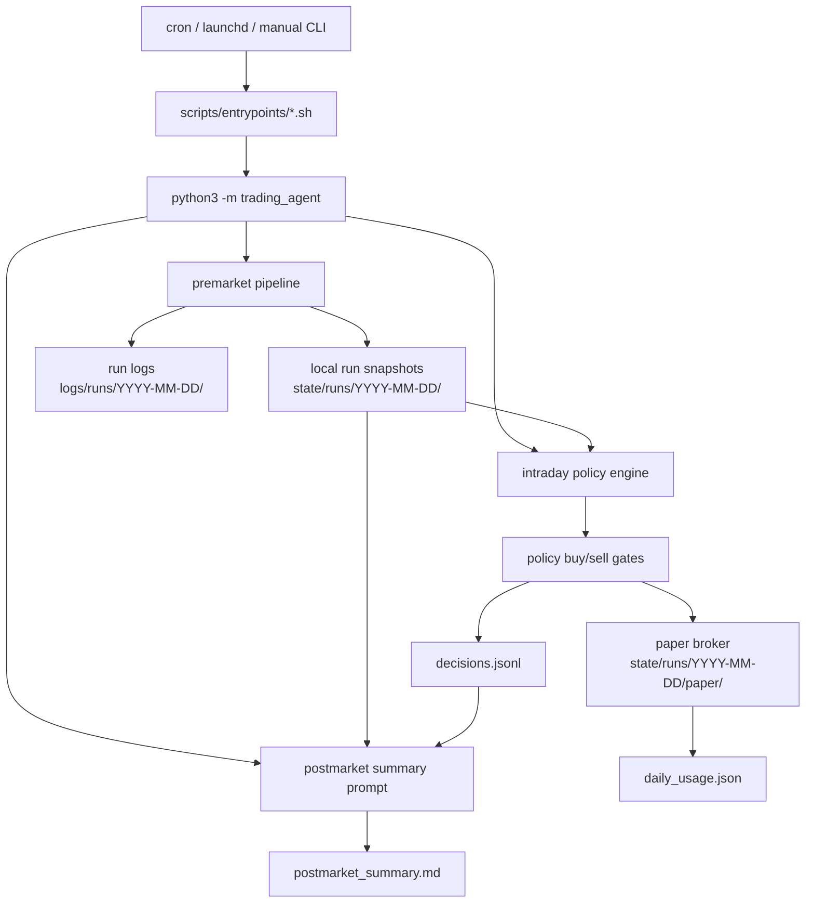
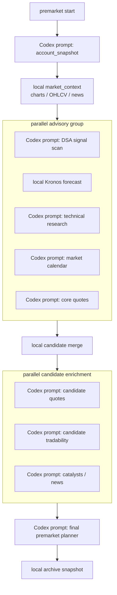

# Robinhood Codex Agent

Low-frequency trading automation for a dedicated Robinhood Agentic Account.

The system is intentionally conservative. Premarket uses Codex and Robinhood MCP to write local
snapshots and a daily plan. Intraday does not call Robinhood MCP directly; it reads those local
snapshots, runs a Python policy engine, and in paper mode updates a local simulated account.

Primary runtime entrypoints:

```bash
python3 -m trading_agent premarket
python3 -m trading_agent intraday
python3 -m trading_agent postmarket
```

Default state is deliberately safe:

- `TRADING_MODE=paper`
- `RISK_TIER=0`
- `KILL_SWITCH` exists
- generated state and logs are ignored by git
- intraday live/review execution is not wired yet and fails closed with `execution_not_wired`
- real order placement tools are not auto-approved

This is automation infrastructure, not financial advice. Live trading can lose money. Keep this in
paper/review mode until the logs are boring and correct.

## System Diagram



Premarket is the only scheduled lifecycle phase that should collect account/quote/tradability data
from Robinhood MCP. Intraday consumes the files premarket wrote.

## Premarket DAG



Advisory failures are logged and fail closed where possible. The final planner is the official source
for `daily_plan.json`, `today_allowlist.txt`, `dynamic_allowlist.json`, and the reset
`daily_usage.json`.

## Package Architecture

```text
trading_agent/
  cli.py                     argparse entrypoint for premarket/intraday/postmarket
  core/                      runtime config, paths, time, JSON helpers, run logs
  orchestration/             lifecycle pipelines
    premarket.py             staged DAG with Codex prompts, local data, and archive
    intraday.py              Python policy engine runner; no direct Robinhood MCP calls
    postmarket.py            Codex summary runner
  prompts/                   Codex subprocess runner and runtime variable block
  policy/                    deterministic intraday buy/sell/risk/scoring logic
  paper/                     local paper broker and ledger updates
  planner/                   deterministic candidate snapshot builder
  data/                      yfinance-backed market context and chart collection
  signals/                   Kronos and technical fallback payload helpers
  reporting/                 premarket archive and postmarket report helpers
  contracts/                 schema validators for generated payloads
```

Shell wrappers live in `scripts/`. They source `scripts/lib/common.sh`, load
`config/runtime.env` plus optional `config/runtime.env.local`, create the dated runtime folders, and
then call the Python package.

## Repository Layout

```text
config/
  allowlist.txt                  emergency fallback symbols
  risk.md                        human-readable hard risk rules
  risk_tiers.json                machine-readable notional caps by tier
  runtime.env                    default mode, model, tier, layer flags
  runtime.env.local              local overrides, ignored by git
  runtime.env.local.example      local override template
  strategy.md                    trading and screening strategy
  universe.txt                   maximum candidate universe
  dsa_strategy_weights.json      DSA-inspired signal weights

prompts/
  signals/dsa_scan.txt
  technical/research.txt
  premarket/account_snapshot.txt
  premarket/market_calendar.txt
  premarket/quote_snapshot_core.txt
  premarket/quote_snapshot_candidates.txt
  premarket/tradability_candidates.txt
  premarket/catalyst_enrichment.txt
  premarket/final_research.txt
  intraday/check.txt             legacy prompt/spec reference; Python policy is active path
  postmarket/summary.txt

scripts/
  lib/common.sh                  shared shell runtime
  entrypoints/                   scheduled lifecycle wrappers
  data/                          market feed and manual research helpers
  kronos/                        portable Kronos setup and runner
  safety/check_safety.sh         local safety sanity checks
  skills/                        repo-owned skill install/verify helpers

docs/
  setup/                         setup notes
  superpowers/specs/             design specs
  superpowers/plans/             implementation plans

state/
  runs/YYYY-MM-DD/               generated runtime state, ignored by git

logs/
  runs/YYYY-MM-DD/               generated runtime logs, ignored by git

launchd/
  *.plist.example                macOS LaunchAgent examples

cron.example                     cron schedule example
KILL_SWITCH                      default safety stop file
.codex/config.toml               project MCP approval policy
```

## Runtime State

Each run date uses the same folder shape:

```text
state/runs/YYYY-MM-DD/
  market_feed/
    manifest.json
    charts/
    ohlcv/
    news/
  signals/
    dsa_signals.json
    kronos_signals.json
    technical_signals.json
  planner/
    account_snapshot.json
    market_calendar.json
    quote_snapshot_core.json
    candidate_snapshot.json
    quote_snapshot_candidates.json
    tradability_snapshot.json
    catalyst_snapshot.json
    today_allowlist.txt
    dynamic_allowlist.json
    daily_plan.json
    daily_plan.md
    daily_usage.json
  paper/
    day_start.json
    day_end.json
    equity_curve.jsonl
    account.json
    positions.json
    orders.jsonl
  archive/
    premarket_report.json
```

```text
logs/runs/YYYY-MM-DD/
  pipeline.jsonl
  codex_runs.log
  errors.log
  decisions.jsonl
  orders.jsonl
  postmarket_summary.md
```

Important state contracts:

- `planner/account_snapshot.json` is the local account/positions/open-orders source created by the
  premarket account snapshot prompt.
- `planner/quote_snapshot_core.json` and `planner/quote_snapshot_candidates.json` provide intraday
  prices.
- `planner/daily_usage.json` starts from the final premarket planner and is updated by paper fills.
- `paper/day_start.json`, `paper/day_end.json`, and `paper/equity_curve.jsonl` are the
  visualization-friendly daily paper snapshots and equity curve.
- `paper/account.json`, `paper/positions.json`, and `paper/orders.jsonl` are the current simulated
  account ledger used only in `TRADING_MODE=paper`.
- In paper mode, policy loading first reads real snapshots and then overlays the paper ledger cash
  and positions.

## Lifecycle

### Premarket

Run:

```bash
python3 -m trading_agent premarket
./scripts/entrypoints/run_premarket.sh
```

Premarket does the following:

1. Writes `planner/account_snapshot.json` with Robinhood account, positions, and open orders.
2. Collects deterministic market context with yfinance-backed data into `market_feed/`.
3. Runs advisory layers in parallel:
   - DSA-inspired signal scan through Codex.
   - Kronos forecast locally.
   - Repo-owned technical research through Codex.
   - Market calendar snapshot through Codex.
   - Core quote snapshot through Codex.
4. Builds `planner/candidate_snapshot.json` locally from account holdings, open orders, and advisory
   signals.
5. Runs candidate quote, tradability, and catalyst enrichment prompts in parallel.
6. Runs the final premarket planner prompt.
7. Archives `archive/premarket_report.json`.
8. Logs stage status to `logs/runs/YYYY-MM-DD/pipeline.jsonl`.

The final planner writes:

- `planner/today_allowlist.txt`
- `planner/dynamic_allowlist.json`
- `planner/daily_plan.json`
- `planner/daily_plan.md`
- `planner/daily_usage.json`
- one `premarket_plan` record in `decisions.jsonl`

Layer flags:

```bash
ENABLE_DSA_SIGNAL_LAYER=0 ./scripts/entrypoints/run_premarket.sh
ENABLE_KRONOS_SIGNAL_LAYER=0 ./scripts/entrypoints/run_premarket.sh
ENABLE_MARKET_FEED_LAYER=0 ./scripts/entrypoints/run_premarket.sh
ENABLE_TECHNICAL_SIGNAL_LAYER=0 ./scripts/entrypoints/run_premarket.sh
```

Useful manual runs:

```bash
./scripts/entrypoints/run_dsa_premarket_scan.sh
./scripts/data/run_market_feed_collection.sh
./scripts/data/run_technical_research.sh
./scripts/data/run_symbol_research.sh NVDA
./scripts/kronos/run_kronos_premarket_scan.sh
```

### Intraday

Run:

```bash
python3 -m trading_agent intraday
./scripts/entrypoints/run_intraday.sh
```

Intraday is a Python policy-engine path:

1. Skips on weekends unless `ALLOW_WEEKEND_RUN=1`.
2. Skips outside 06:45-12:55 America/Los_Angeles unless `ALLOW_OUTSIDE_MARKET_TEST=1`.
3. Skips when `KILL_SWITCH` exists unless `ALLOW_KILL_SWITCH_PAPER_TEST=1`.
4. Loads runtime mode and risk tier from config.
5. Loads local policy inputs from config, planner files, signals, account snapshot, and quote
   snapshots.
6. In paper mode, overlays local paper cash/positions from `state/runs/YYYY-MM-DD/paper/`.
7. Runs deterministic sell-first then buy policy.
8. Appends exactly one decision to `logs/runs/YYYY-MM-DD/decisions.jsonl`.

Intraday does not call Robinhood MCP directly. If premarket snapshots are missing, the policy engine
fails closed with blocked reasons such as `missing_daily_plan`, `missing_account`, or
`missing_quote`.

Policy behavior:

- Sell evaluation runs before buy evaluation.
- Sell can generate partial take-profit or risk-exit intents when the daily plan allows them.
- Buy requires the intersection of `universe.txt`, `today_allowlist.txt`, and
  `daily_plan.today_watchlist`.
- Buy requires a score of at least 80, a fresh quote, no open order, no average-down into a losing
  position, daily cap room, single-order cap room, and buying power.
- Review/live currently block with `execution_not_wired`.

### Paper Mode

Paper mode is the active execution simulation path.

When policy returns `would_trade`:

- `trading_agent.paper.broker.apply_paper_intent()` applies an immediate simulated fill at the limit
  price.
- Buys reduce `paper/account.json` cash and update weighted average cost in `paper/positions.json`.
- Sells require an existing paper position, increase cash, reduce/remove the position, and update
  realized PnL.
- Every fill appends to `paper/orders.jsonl`.
- The first paper intraday run writes `paper/day_start.json` once.
- Postmarket writes `paper/day_end.json`.
- Paper fills append `fill` points to `paper/equity_curve.jsonl`; day start/end append their own
  equity curve points.
- Every fill updates `planner/daily_usage.json`:
  - `used_notional`
  - `paper_filled_notional`
  - `paper_order_count`
  - `updated_at`

If paper cash or paper position quantity is insufficient, the fill is not applied and the reason is
added to the decision.

### Review And Live

Review and live order execution are intentionally not wired into the Python policy path yet.

Current behavior:

- `TRADING_MODE=review`: policy may produce an order intent but returns `blocked` with
  `execution_not_wired`.
- `TRADING_MODE=live`: same fail-closed behavior.
- `review_equity_order` and `place_equity_order` are not called by intraday Python.

This keeps the system useful for paper operations while preserving a hard boundary before real
execution is added.

### Postmarket

Run:

```bash
python3 -m trading_agent postmarket
./scripts/entrypoints/run_postmarket.sh
```

Postmarket still runs the Codex prompt at `prompts/postmarket/summary.txt`. It is review-only and
should read local state/logs plus Robinhood data to reconcile the day, identify rule violations or
data failures, and write:

- `logs/runs/YYYY-MM-DD/postmarket_summary.md`
- one `postmarket_summary` record in `decisions.jsonl`

## Safety Model

Hard defaults and rules:

- only the dedicated Robinhood Agentic Account
- only long equities or ETFs
- no options
- no crypto
- no futures
- no margin
- no short selling
- no leveraged or inverse ETFs
- only limit orders
- max single order and daily notional are capped by the configured risk tier and daily plan
- if data is missing, stale, or inconsistent, do nothing
- if `KILL_SWITCH` exists, intraday trading is blocked
- DSA, Kronos, and technical signals are advisory only
- intraday does not call Robinhood MCP directly
- real execution remains unwired in Python policy

Project MCP approval policy:

- Robinhood read tools are auto-approved for scheduled Codex prompts.
- `review_equity_order` may be auto-approved for future review-mode simulation.
- `place_equity_order`, cancellation, option order tools, and watchlist-write tools remain
  prompt-gated.

Run the safety check:

```bash
./scripts/safety/check_safety.sh
```

## Repo-Owned Trading Skills

This repo ships trading skill packs under `.agents/skills/`.

Install or refresh them into local agent skill directories:

```bash
./scripts/skills/install_repo_skills.sh
./scripts/skills/verify_repo_skills.sh
```

Current repo-owned skills:

- `chan-structure-trading`
- `brooks-trading-range-price-action`
- `equity-fundamentals-analysis`
- `trading-research-casebook-maintenance`

The premarket technical research prompt uses these skills as analysis context. They remain advisory
and cannot authorize trades.

## Setup

Install and authenticate Codex, then connect Robinhood Trading MCP:

```bash
codex login
codex mcp add robinhood-trading --url https://agent.robinhood.com/mcp/trading
codex
/mcp
```

Complete Robinhood Agentic Account authentication on desktop.

Install repo-owned skills:

```bash
./scripts/skills/install_repo_skills.sh
./scripts/skills/verify_repo_skills.sh
```

Portable Kronos setup requires `git` and Python `3.11` or `3.12`. The setup script prefers
`python3.12`, then `python3.11`, then a supported `python3`.

```bash
KRONOS_BOOTSTRAP_PYTHON=$(command -v python3.12) ./scripts/kronos/setup_kronos_env.sh
./scripts/kronos/verify_kronos_env.sh
```

For a clean Kronos rebuild:

```bash
rm -rf .venv-kronos .vendor/kronos
./scripts/kronos/setup_kronos_env.sh
./scripts/kronos/verify_kronos_env.sh
```

Portable rebuild and validation flow:

```bash
git clone <repo-url>
cd trading
find scripts -name '*.sh' -exec chmod +x {} +
./scripts/kronos/setup_kronos_env.sh
./scripts/kronos/verify_kronos_env.sh
./scripts/safety/check_safety.sh
ALLOW_WEEKEND_RUN=1 KRONOS_USE_MOCK=1 ./scripts/kronos/run_kronos_premarket_scan.sh
ALLOW_WEEKEND_RUN=1 CODEX_EXEC_DRY_RUN=1 ./scripts/entrypoints/run_premarket.sh
```

## Dry Run And Local Tests

Dry-run scheduled shell wrappers without invoking Codex:

```bash
CODEX_EXEC_DRY_RUN=1 ./scripts/entrypoints/run_premarket.sh
CODEX_EXEC_DRY_RUN=1 ./scripts/entrypoints/run_intraday.sh
CODEX_EXEC_DRY_RUN=1 ./scripts/entrypoints/run_postmarket.sh
```

Run a full paper lifecycle locally:

```bash
ALLOW_OUTSIDE_MARKET_TEST=1 ./scripts/entrypoints/run_all_paper_once.sh
```

`run_all_paper_once.sh` requires `TRADING_MODE=paper`, temporarily moves `KILL_SWITCH` aside, runs
premarket, intraday, and postmarket, then restores `KILL_SWITCH`.

Run unit tests:

```bash
python3 -m unittest discover -s tests -v
```

## Schedule

Times are America/Los_Angeles:

- `05:30` premarket research
- `06:45` first intraday check
- every 30 minutes until `12:45`
- `13:10` postmarket summary

Use `cron.example` or `launchd/*.plist.example` after replacing `__REPO_ROOT__` with your local
repository path.

`launchd` is the built-in macOS scheduler. In this repo it serves the same role as `cron`: starting
`premarket`, `intraday`, and `postmarket` runs on a schedule. Use `launchd` on macOS if you want the
jobs managed by LaunchAgents; use `cron` if you prefer a shell-level scheduler.

## Rollout

Recommended rollout:

1. Paper only: inspect `would_trade`, `paper_fill`, `blocked`, and `no_action` decisions.
2. Paper with repeated intraday runs: confirm `paper/` ledger and `daily_usage.json` update
   correctly.
3. Review mode design: wire `review_equity_order` only after tests prove the review path remains
   non-placing.
4. Live tier 0: add live execution only after review logs are clean and a human explicitly removes
   `KILL_SWITCH`.
5. Raise tiers manually only after clean postmarket summaries.

Never let Codex edit `RISK_TIER` by itself. Postmarket may recommend a tier change, but the human
changes it.

## Generated Files

These are intentionally ignored by git:

- `state/runs/YYYY-MM-DD/market_feed/`
- `state/runs/YYYY-MM-DD/signals/`
- `state/runs/YYYY-MM-DD/planner/`
- `state/runs/YYYY-MM-DD/paper/`
- `state/runs/YYYY-MM-DD/archive/`
- `logs/runs/YYYY-MM-DD/`

Keep generated state and logs local because they can contain account size, decisions, symbols,
timestamps, and operational details.

Project documentation under `docs/` is tracked when it describes setup, specs, or implementation
plans. Machine-specific values belong in `config/runtime.env.local`, which is ignored by git.
