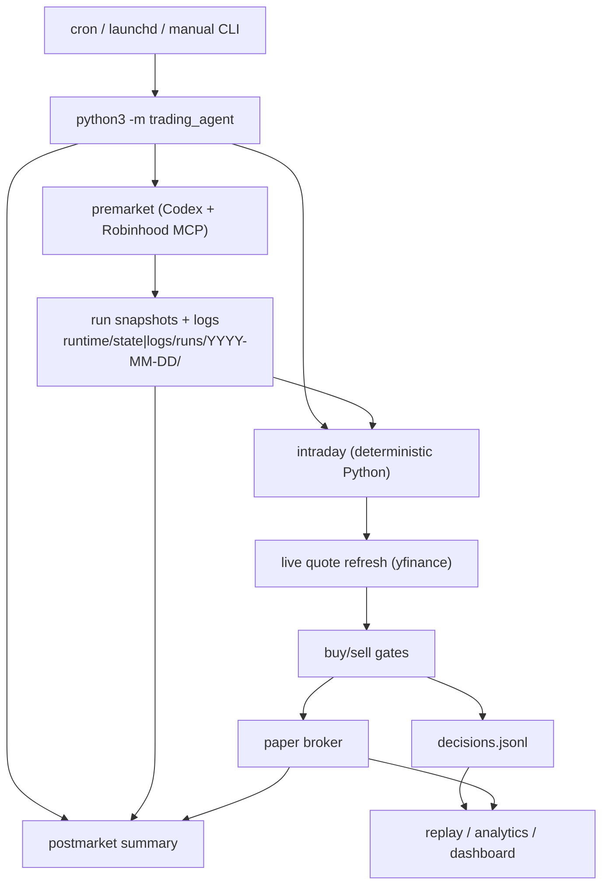

# Robinhood Codex Agent

Low-frequency trading automation for a single dedicated Robinhood Agentic Account. Premarket uses
Codex (LLM) + the Robinhood Trading MCP to gather data and write a daily plan; **everything
downstream is deterministic Python**. Intraday never calls Robinhood directly — it reads the
premarket snapshots, refreshes live quotes, runs a Python policy engine, and (in paper mode) updates
a local simulated ledger. The system is conservative and **fail-closed**: missing/stale data → do
nothing.

> Automation infrastructure, **not financial advice**. Live trading can lose money. Real order
> placement is intentionally **not wired** in Python (fails closed with `execution_not_wired`). Keep
> it in paper mode until the logs are boring and correct.

---

## Quick Start

```bash
# 0. One-time setup (Codex + Robinhood MCP + Kronos) — see "Setup" below.

# 1. Inspect the effective config (mode, tiers/caps, feature flags). Run this first when unsure.
python3 -m trading_agent doctor

# 2. Run a paper day.
python3 -m trading_agent premarket     # gather data → daily plan
python3 -m trading_agent intraday      # one policy decision per run (repeat every ~30 min)
python3 -m trading_agent postmarket    # day-end paper summary + Codex review

# 3. Look at results.
python3 -m trading_agent replay            # fill rate + blocked-reason stats
python3 -m trading_agent analytics build   # build runtime/analytics/analytics.db
python3 -m trading_agent dashboard         # read-only Streamlit UI (localhost:8501)
```

Defaults are paper-only and safe (see **Safe by default**). The canonical operational path is the
shell wrappers in `src/scripts/entrypoints/` (they export the cron/launchd defaults); the
`python3 -m trading_agent` commands above are equivalent for manual use and all accept `--dry-run`.

---

## Using each command

### Daily lifecycle
| Command | What it does |
|---|---|
| `premarket` | Full premarket pipeline → `daily_plan`, candidate scores, risk overlay. The only phase that talks to Robinhood MCP. |
| `intraday` | Deterministic sell-then-buy policy + paper broker; refreshes live quotes; appends exactly one decision per run. No MCP calls. |
| `postmarket` | Paper day-end ledger + performance summary + Codex review. |
| `dsa` | Standalone DSA signal scan (also runs inside premarket). |

### Inspect & analyze
| Command | What it does |
|---|---|
| `doctor` | Print effective config (mode, tiers/caps, feature flags) and exit. |
| `replay [--since --until --output]` | Local paper analytics: fill rate + blocked-reason distribution across run dates. |
| `analytics build [--since --until]` | (Re)build `runtime/analytics/analytics.db` (SQLite) from run state — feeds the dashboard. |
| `analytics calibrate [--since --until]` | E1 strategy calibration → `calibration_report.{json,md}`: score-bucket forward returns (1/5/21/63d) + per-candidate excess vs SPY, multi-horizon Rank IC + t-stat, benchmark alpha, setup outcomes (needs network for yfinance). |
| `analytics fill-quality [--since --until]` | E4 fill-quality → `fill_quality_report.{json,md}`: realized per-order slippage + conservative-fill sensitivity (how much paper edge shrinks under spread-aware fills). Local-only. |
| `analytics ai-signal-study [--since --until]` | H3 AI-signal study → `ai_signal_study.{json,md}`: per-layer (DSA/Kronos/Catalyst) confidence calibration, directional accuracy, confidence→return IC, reason/warning-code lift (needs network for yfinance). |
| `dashboard` | Read-only Streamlit UI at `localhost:8501`: sidebar + 8 tabs (Today / Candidates / Decisions / Paper / **Strategy Comparison** / **Calibration** / Self-Growth / Themes). |

### Self-growth (paper/shadow only — proposes, never auto-applies)
Diagnoses the system, proposes **bounded** experiments, runs challenger strategies in **shadow
paper**, and recommends promotions — but it **never** edits the champion strategy or auto-promotes to
live. Promotion is always a manual `strategy_registry.yaml` edit by a human.

```bash
# Diagnose → propose → validate (writes files only; enables nothing)
python3 -m trading_agent growth observe
python3 -m trading_agent growth propose
python3 -m trading_agent growth validate runtime/strategy_proposals/<date>/

# A human queues + approves a challenger for shadow (does NOT switch the champion)
python3 -m trading_agent growth experiments add runtime/strategy_proposals/<date>/proposal_001_*.json
python3 -m trading_agent growth experiments approve <experiment_id>

# Challengers run in isolated shadow ledgers (also auto-runs after each intraday)
python3 -m trading_agent growth shadow

# Compare champion vs challengers, then draft a promotion for human review
python3 -m trading_agent growth recommend
python3 -m trading_agent growth promote check <experiment_id>
```

Permanently forbidden from any mutation (hard-coded): `TRADING_MODE`, `RISK_TIER`, `PAPER_RISK_TIER`,
`KILL_SWITCH`, MCP approval, `place_equity_order`, `per_trade_risk_pct`, `max_daily_risk_pct`,
`max_single_stock_weight`. Full design: [`docs/roadmap.md`](docs/roadmap.md) G phase.

---

## Safe by default

| Setting | Default | Meaning |
|---|---|---|
| `TRADING_MODE` | `paper` | Simulated fills only; no real orders |
| `RISK_TIER` | `3` | Live/review caps ($5k single / $20k daily) |
| `PAPER_RISK_TIER` | `4` | Paper-only "paper_max" ($100k/$400k); caps high so risk-budget binds |
| `PAPER_STARTING_CASH` | `400000` | Paper ledger seed cash |
| `KILL_SWITCH` | present | Hard stop for review/live intraday; paper may still run |

**Hard rules:** dedicated Agentic account only · long equities/ETFs only (no options/crypto/futures/
margin/shorts) · limit orders only · notional capped by tier + daily plan · missing/stale data → do
nothing · DSA/Kronos/technical signals are advisory only · real execution unwired in Python. Verify
with `./src/scripts/safety/check_safety.sh`.

**Risk tiers** (`src/config/risk_tiers.json`; effective tier depends on `TRADING_MODE`):

| Tier | Single / Daily | Use |
|---|---|---|
| 0–2 | $10/$25 → $50/$150 | live micro → moderate |
| 3 | $5k / $20k | small dedicated live |
| 4 | $100k / $400k | **paper only** |

In paper mode the binding constraints are `per_trade_risk_pct` and the portfolio-weight caps, not the
dollar ceiling. `doctor` prints the effective tier and caps.

---

## How it works



- **Premarket** is the only phase that talks to Robinhood MCP. Deterministic Python layers own the
  numbers (capital, scoring, risk overlay, sizing); Codex owns reasoning (DSA classification,
  technical research, catalysts, final narrative).
- **Intraday** consumes premarket artifacts but **must refresh live quotes** each run — snapshot
  quotes are never a valid execution fallback. It runs a sell-first-then-buy policy and writes one
  decision.
- **Active watchlist vs universe**: the cheap DSA scan runs over the full `universe.txt` (~88
  symbols); the expensive layers (Kronos, market_feed, technical) run only over `active_watchlist.txt`
  (≤30), falling back to the full universe if absent.
- **Generated state/logs** under `runtime/` are git-ignored (they contain account size, decisions,
  symbols, timestamps). Machine-specific values go in `src/config/runtime.env.local` (also ignored).

Internals — premarket DAG, scoring weights, buy ranking/gating, sizing, paper fill model, token
precompute — are documented in [`docs/project-status.md`](docs/project-status.md).

---

## Configuration (`src/config/`)

Key files: `runtime.env` (defaults; `runtime.env.local` for machine overrides, git-ignored) ·
`risk_tiers.json` · `policy_profiles.json` · `scoring_profiles.yaml` · `universe.txt` /
`active_watchlist.txt` / `universe_meta.json` · `strategy_registry.yaml` (active strategy version) ·
`growth_policy.json` (self-growth safety boundary) · `risk.md` / `strategy.md` (human-readable rules).

Common env knobs:
```bash
TRADING_MODE=paper
RISK_TIER=3 / PAPER_RISK_TIER=4
PAPER_STARTING_CASH=400000
PAPER_FILL_MODEL=conservative / PAPER_SLIPPAGE_BPS=10
ENABLE_DSA_SIGNAL_LAYER / ENABLE_KRONOS_SIGNAL_LAYER / ENABLE_TECHNICAL_SIGNAL_LAYER / ENABLE_MARKET_FEED_LAYER=1
MARKET_FEED_TIMEFRAMES=1w,1d,1h,15m
```
Precedence: shell exports > `runtime.env.local` > `runtime.env` > `strategy_registry.yaml` defaults.
`doctor` shows the resolved values.

---

## Setup

```bash
# Codex + Robinhood MCP
codex login
codex mcp add robinhood-trading --url https://agent.robinhood.com/mcp/trading
codex; /mcp        # complete Agentic Account auth on desktop

# Repo-owned trading skills (advisory context for technical research; cannot authorize trades)
./src/scripts/skills/install_repo_skills.sh && ./src/scripts/skills/verify_repo_skills.sh

# Portable Kronos (needs git + Python 3.11/3.12; prefers python3.12)
KRONOS_BOOTSTRAP_PYTHON=$(command -v python3.12) ./src/scripts/kronos/setup_kronos_env.sh
./src/scripts/kronos/verify_kronos_env.sh
```

Optional dashboard dependency: `pip install -e ".[dashboard]"` (streamlit). Default Kronos model
`NeoQuasar/Kronos-base`; live generation batches by history-window length and falls back to
per-symbol inference if batch support is missing.

---

## Tests & dry runs

```bash
python3 -m pytest tests/ -q                                            # unit tests
CODEX_EXEC_DRY_RUN=1 ./src/scripts/entrypoints/run_premarket.sh        # dry-run without Codex
ALLOW_OUTSIDE_MARKET_TEST=1 ./src/scripts/entrypoints/run_all_paper_once.sh   # full paper lifecycle
```

---

## Schedule & rollout

Scheduled (America/Los_Angeles) via `cron.example` / `launchd/*.plist.example`: `05:30` premarket ·
`06:45`–`12:45` intraday every 30 min · `13:10` postmarket.

Rollout: paper → review → live tier 0, advancing only after clean logs. A human removes `KILL_SWITCH`
and sets `RISK_TIER`; Codex never does. Postmarket may *recommend* a tier change; a human makes it.

---

## Docs

- [`docs/daily-strategy-playbook.md`](docs/daily-strategy-playbook.md) — **what to do each day/week/month to keep improving the strategy** (start here for operations).
- [`docs/roadmap.md`](docs/roadmap.md) — prioritized remaining work; see the "🎯 当前焦点" block for the next steps.
- [`docs/project-status.md`](docs/project-status.md) — block-by-block account of what's built (and what isn't).
- `docs/setup/` — setup notes · `docs/superpowers/` — design specs & plans.
