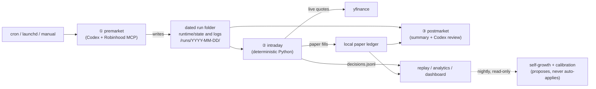
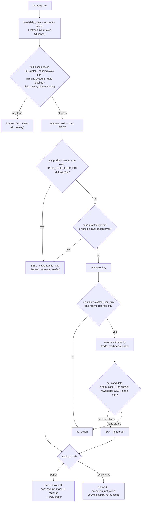

# Robinhood Codex Agent

Configurable-frequency trading automation for a single dedicated Robinhood Agentic Account.
Trading frequency is a config choice (low ~30 min / medium ~5 min / high ~1 min presets — see
[Frequency presets](#frequency-presets)); the default active preset is **medium**. The day splits
into three phases:

- **Premarket** — Codex (LLM) + the Robinhood Trading MCP gather data and write a **daily plan**.
- **Intraday** — **deterministic Python** reads the premarket snapshots, refreshes live quotes, runs
  a policy engine, and (in paper mode) updates a local simulated ledger. **Never calls Robinhood.**
- **Postmarket** — day-end paper ledger + performance summary + a Codex review.

The system is conservative and **fail-closed**: missing or stale data → do nothing.

> Automation infrastructure, **not financial advice**. Live trading can lose money. Real order
> placement is intentionally **not wired** in Python (fails closed with `execution_not_wired`). Keep
> it in paper mode until the logs are boring and correct.

---

## Quick Start

```bash
# 0. One-time setup (Codex + Robinhood MCP + Kronos) — see "Setup" below.

python3 -m trading_agent doctor        # print effective config — run this first when unsure

# Run a paper day:
python3 -m trading_agent premarket     # gather data → daily plan (the only phase that calls MCP)
python3 -m trading_agent intraday      # one policy decision per run (cadence set by active preset)
python3 -m trading_agent postmarket    # day-end paper summary + Codex review

# Look at results:
python3 -m trading_agent replay            # fill rate + blocked-reason stats
python3 -m trading_agent analytics build   # build runtime/analytics/analytics.db
python3 -m trading_agent dashboard         # read-only Streamlit UI (localhost:8501)
```

Defaults are paper-only and safe. Manual runs can use either `python3 -m trading_agent ...` or the
shell wrappers in `src/scripts/entrypoints/`. The macOS launchd plists use the Python module
entrypoints directly (`.venv/bin/python -m trading_agent ...`) because launchd can reject repo-local
shell wrappers under `~/Documents` with `Operation not permitted`.

---

## System overview



Premarket owns **reasoning** (Codex: DSA classification, technical research, catalysts, narrative).
Deterministic Python owns the **numbers** (capital, scoring, risk overlay, sizing, fills) — so the
parts that move money are testable and reproducible, and the LLM is advisory only.

---

## ① Premarket pipeline — building the daily plan

`premarket` runs a fixed DAG. Sequential prerequisites first, then two **parallel** fan-out stages,
then a deterministic score→plan tail. Every step writes a JSON artifact into the dated run folder;
each box below is annotated with what it produces. **Advisory** steps (wrapped so a failure never
breaks the run) are the LLM/model signal layers.

```mermaid
flowchart TD
    subgraph S1["1 · Account and market context (sequential)"]
        direction TB
        A1["account_snapshot<br/><i>positions, buying power</i>"] --> A2["capital_snapshot<br/><i>deployable capital</i>"] --> A3["market_context<br/><i>OHLCV via yfinance/MCP</i>"]
    end

    subgraph S2["2 · Signal layers (parallel · advisory)"]
        direction LR
        B1["DSA scan (Codex)<br/><i>theme/priority/crowding<br/>full universe ~88</i>"]
        B2["Kronos forecast<br/><i>price bias · watchlist ≤30</i>"]
        B3["technical research (Codex)<br/><i>entry/stop/target levels</i>"]
        B4["market_calendar (Codex)"]
        B5["quote_snapshot_core (Codex)"]
        B6["price factors (H2)<br/><i>factor_panel + factor_alpha</i>"]
    end

    subgraph S3["3 · Candidate set (sequential)"]
        direction TB
        C1["trader_watch_levels"] --> C2["candidate_merge<br/><i>candidate_snapshot.json</i>"] --> C3["quote_snapshot_candidates"]
    end

    subgraph S4["4 · Candidate enrichment (parallel · advisory)"]
        direction LR
        D1["tradability_candidates"]
        D2["catalyst_enrichment (Codex)<br/><i>events, earnings risk</i>"]
    end

    subgraph S5["5 · Score and plan (deterministic)"]
        direction TB
        E1["ai_signals (H3) · advisory<br/><i>normalize DSA/Kronos/catalyst<br/>→ ai_signals.json (not in score)</i>"] --> E1b["fundamental_layer (H7) · advisory<br/><i>quality flags → fundamental_snapshot.json<br/>(write-only, not in score)</i>"] --> E1c["event_layer (H8) · advisory<br/><i>earnings/analyst flags → event_snapshot.json<br/>(write-only, not in score)</i>"] --> E2["data_status_summary<br/><i>fail-closed gate</i>"]
        E2 --> E3["candidate_scoring<br/><b>5-component weighted score</b><br/><i>→ candidate_scores.json</i>"]
        E3 --> E4["risk_overlay<br/><i>regime · watchlist · tradable<br/>· allowed_actions</i>"]
        E4 --> E5["final_planner (Codex)<br/><b>daily_plan.json</b>"] --> E6["archive"]
    end

    S1 --> S2 --> S3 --> S4 --> S5
```



**Candidate scoring (step 5, E3)** — the deterministic 5-component weighted score that ranks the
universe. Each component is scaled by its own confidence before weighting:

| Component | Weight | Source |
|---|---|---|
| `technical` | 0.30 | technical research levels / action |
| `dsa` | 0.25 | DSA theme + promote/demote classification |
| `catalyst` | 0.20 | catalyst enrichment |
| `kronos` | 0.15 | Kronos price-forecast bias |
| `quote` | 0.10 | live quote freshness/quality |

→ `candidate_score`. **risk_overlay** then sorts candidates, applies regime/concentration caps, and
emits `watchlist_candidates`, `tradable_candidates`, and `allowed_actions`, which **final_planner**
turns into `daily_plan.json` — the single contract intraday consumes.

> **Active watchlist vs universe**: the cheap DSA scan runs over the full `universe.txt` (~88
> symbols); the expensive layers (Kronos, market_feed, technical) run only over
> `active_watchlist.txt` (≤30), falling back to the full universe if absent.

---

## ② Strategy — how one intraday decision is made

`intraday` is pure deterministic Python. It loads the premarket artifacts, **refreshes live quotes**
(snapshot quotes are never a valid execution fallback), then runs the policy engine, which is a
chain of **fail-closed gates** followed by **sell-first, then buy**. It appends exactly one decision
per run and, in paper mode, updates the local ledger.

Both `intraday` and `postmarket` now resolve the repo root from the code location or an explicit
`AGENT_ROOT` override, so they do not depend on the launchd working directory. `postmarket` also
resolves the `codex` executable from `CODEX_BIN`, `PATH`, or common install locations, which avoids
the launchd-only `codex: not found` failure.



**Buy ranking (`trade_readiness_score`)** — a 6-component blend used to order survivors of the hard
blocks; the highest-ranked candidate that also clears the price/size gates becomes the order:

```
trade_readiness_score = 0.35·candidate_score + 0.25·technical + 0.15·price_setup
                      + 0.10·liquidity + 0.10·research + 0.05·catalyst
```

Key properties: **sell is evaluated before buy** (risk reduction wins ties); the **catastrophic hard
stop** guarantees every position has an automatic exit even with no technical levels and a plan that
permits no discretionary sell; **review/live placement is never wired** in Python — it always blocks
with `execution_not_wired`, so only a human can take it live.

**M-stage advisory overlay (in progress)** — `ENABLE_INTRADAY_ADVISORY_OVERLAY=0` by default, so the
current champion intraday path is unchanged. When enabled for paper/shadow testing, intraday loads
the H2 `factor_alpha`, H3 `ai_signals`, K1 `portfolio_target`, and K2 `regime_state` artifacts into
a normalized `advisory_overlay` object for later ranking/risk/audit use. M1 only loads and
normalizes these artifacts; M4 now writes the per-symbol overlay into intraday rankings, proposed
orders, email, and the dashboard 选股与决策 area (决策叠加 section). M2 applies H2/H3-derived `rank_delta` to the intraday
`trade_readiness_score` only when the flag is enabled; it does not add hard blocks, change sizing, or
wire real order placement. M3 lets K1/K2 tighten only: `risk_off`/`panic` regime or portfolio
breaches can block new buys, and regime/portfolio multipliers can only reduce order size. M5 core
feeds overlay components into forward-return calibration/growth evidence and whitelists bounded
paper-only overlay mutations in `growth_policy.json`, so the system can measure whether the overlay
actually improved outcomes before any further promotion.

---

## Using each command

### Daily lifecycle
| Command | What it does |
|---|---|
| `premarket` | Full premarket pipeline → `daily_plan`, candidate scores, risk overlay. The only phase that talks to Robinhood MCP. |
| `intraday` | Deterministic sell-then-buy policy + paper broker; refreshes live quotes; appends exactly one decision per run. No MCP calls. |
| `postmarket` | Paper day-end ledger + performance summary + Codex review. |
| `dsa` | Standalone DSA signal scan (also runs inside premarket). |

### Inspect & analyze (all read-only)
| Command | What it does |
|---|---|
| `doctor` | Print effective config (mode, tiers/caps, feature flags) and exit. |
| `replay [--since --until --output]` | Local paper analytics: fill rate + blocked-reason distribution across run dates. |
| `analytics build [--since --until]` | (Re)build `runtime/analytics/analytics.db` (SQLite) from run state — feeds the dashboard. |
| `analytics calibrate [--since --until]` | E1 calibration → `calibration_report.{json,md}`: score-bucket forward returns (1/5/21/63d) + excess vs SPY, multi-horizon Rank IC + t-stat, benchmark alpha, setup outcomes. |
| `analytics fill-quality [--since --until]` | E4 → `fill_quality_report.{json,md}`: realized per-order slippage + conservative-fill sensitivity (how much paper edge shrinks under spread-aware fills). |
| `analytics ai-signal-study [--since --until]` | H3 → `ai_signal_study.{json,md}`: per-AI-layer confidence calibration, directional accuracy, confidence→return IC, reason/warning-code lift. |
| `analytics ai-ablation [--since --until]` | H3 → `ai_ablation.{json,md}`: per-AI-layer marginal IC (leave-one-out) + factor-only and AI+factor comparison. |
| `analytics weight-suggestion [--horizon --damping]` | E2 → `weight_suggestion.json`: IC-backed scoring-weight **suggestion**. Never auto-applied (adopt via a new strategy version + shadow run). |
| `analytics snapshot [--date]` | I2: archive a dated copy of tonight's reports to `runtime/analytics/history/<date>/` + `nightly_summary.json`. Idempotent. |
| `analytics trend [--since --until --output]` | I3: aggregate `history/*/nightly_summary.json` into per-metric time series → `trend.json`. |
| `analytics nightly-health` | L4 → `nightly_health.json`: report freshness + the last nightly run's failed steps. Surfaced as a 🟢/🔴 banner on the dashboard 今日驾驶舱 area. |
| `analytics validate [--since --until]` | N3 → `validate_report.{json,md}`: read-only scan of run JSONL for malformed lines + rows missing key fields (per source + per run). Modifies nothing; `status=ok` when clean. |
| `analytics retention [--keep-days N] [--apply]` | N4 → `retention_report.{json,md}`: prune big premarket input snapshots (`market_feed/`) from runs older than `--keep-days` (default 60), keeping all analysis inputs. **Dry-run unless `--apply`.** |
| `analytics thesis [--since --until]` | K3 → `thesis_attribution.{json,md}`: per-thesis (theme/DSA tags) win rate + mean forward return — "which theses actually make money". |
| `dashboard` | Read-only Streamlit UI (`localhost:8501`, 中文 / 深色主题): **5 主区** — 📊 今日驾驶舱 / 🎯 选股与决策 / 💰 业绩与对比 / 🔬 校准与归因 / 🌱 成长与趋势. 每主区带「这是什么 / 怎么看 / 建议」引导，关键指标带好坏色标、同比 delta 与 SPY 基准对比。Honors `AGENT_ROOT`. |

### Nightly batch (read-only / shadow-only)
`python3 -m trading_agent nightly-analysis` runs the analytics + self-growth commands best-effort
after the close (rebuild DB → calibrate → fill-quality → AI study/ablation → weight-suggestion →
growth observe/propose/validate/shadow/evaluate → snapshot → trend). It never trades, approves, or
promotes. Gated by `ENABLE_NIGHTLY_ANALYSIS` (default 1). The shell wrapper
`src/scripts/entrypoints/run_nightly_analysis.sh` remains available for manual/cron use.

### Analytics database (`runtime/analytics/analytics.db`)

A local **SQLite** database that the dashboard and ad-hoc SQL queries read. It is a **derived view**,
not a source of truth: the authoritative data is the per-day JSON/JSONL under
`runtime/state/runs/<date>/` and `runtime/logs/runs/<date>/audit/`. The DB is rebuilt from those files.

**Setup / build** — no separate install (SQLite ships with Python). Just build it from run data:

```bash
python3 -m trading_agent analytics build                 # (re)build from all run dates
python3 -m trading_agent analytics build --since 2026-06-01 --until 2026-06-30   # a window
```

`build` is **idempotent**: it drops and recreates every table each time, so re-running never
duplicates rows and always reflects the latest files on disk. Empty data → empty tables (0 rows), no
error. The nightly batch rebuilds it automatically; run it manually whenever you want fresh tables.

To sanity-check the source files before trusting the DB, run `analytics validate` — a read-only scan
that reports malformed JSONL lines and rows missing key fields (it modifies nothing).

**Tables** (one DB, 10 tables): `runs` (per-day manifest: strategy_id / git_commit / config_hash),
`candidates` (per run×symbol scores + watchlist/tradable flags), `decisions` (one row per intraday
decision; includes `blocked_reasons` / `per_candidate_blocks` / `advisory_overlay` / `thesis_tags` as
JSON), `orders` (paper orders incl. E4 `spread_bps`/`slippage_bps` + setup levels), `paper_equity`
(equity-curve checkpoints), `blocked_reasons` (per run×reason counts), `intraday_rankings`
(per-run ranked candidates incl. `base_trade_readiness_score`/`advisory_rank_delta`), and the K-stage
advisory tables `factor_alpha` (H2), `regime_state` (K2), `portfolio_target` (K1). Common
filter/sort columns are indexed.

**Querying** — it is plain SQLite, so use anything: the `dashboard` (easiest, read-only UI), the
`sqlite3` CLI, or Python. Example:

```bash
sqlite3 runtime/analytics/analytics.db \
  "SELECT run_date, symbol, candidate_score FROM candidates ORDER BY candidate_score DESC LIMIT 10;"
```

> Schema changes need **no migration** — just re-run `analytics build` (the DB is recreated from the
> JSON). The DB lives under git-ignored `runtime/`, so it is per-machine and safe to delete/rebuild.

**Disk growth** — over months, `runtime/state/runs/*` grows (mostly the per-day `market_feed/` OHLCV
+ chart snapshots). `analytics retention --keep-days 60` reports how much old-run `market_feed/` data
could be reclaimed; add `--apply` to actually prune it. It only removes those regenerable input
snapshots — the small analysis inputs (scores/decisions/orders) are always kept, so calibration and
replay still run on pruned runs.

### Self-growth (paper/shadow only — proposes, never auto-applies)
Diagnoses the system, proposes **bounded** experiments, runs challenger strategies in **shadow
paper**, and recommends promotions — but it **never** edits the champion strategy or auto-promotes to
live. Promotion is always a manual `strategy_registry.yaml` edit by a human.

```bash
python3 -m trading_agent growth observe        # diagnose → growth_observations.json
python3 -m trading_agent growth propose        # write bounded, whitelist-only proposals (enables nothing)
python3 -m trading_agent growth validate runtime/strategy_proposals/<date>/
python3 -m trading_agent growth experiments add  runtime/strategy_proposals/<date>/proposal_001_*.json
python3 -m trading_agent growth experiments approve <experiment_id>   # human gate: enables shadow only
python3 -m trading_agent growth shadow         # run challengers in isolated shadow ledgers
python3 -m trading_agent growth recommend      # compare champion vs challengers
python3 -m trading_agent growth promote check <experiment_id>         # drafts a changelog only
```

Permanently forbidden from any mutation (hard-coded): `TRADING_MODE`, `RISK_TIER`, `PAPER_RISK_TIER`,
`KILL_SWITCH`, MCP approval, `place_equity_order`, `per_trade_risk_pct`, `max_daily_risk_pct`,
`max_single_stock_weight`. Full design: [`docs/roadmap.md`](docs/roadmap.md) G phase.

---

## Safe by default

| Setting | Default | Meaning |
|---|---|---|
| `TRADING_MODE` | `paper` | Simulated fills only; no real orders |
| `RISK_TIER` | `3` | Live/review caps ($5k single / $20k daily) |
| `PAPER_RISK_TIER` | `4` | Paper-only "paper_max" ($100k/$400k); caps high so risk-budget binds |
| `PAPER_STARTING_CASH` | `400000` | Paper ledger seed cash |
| `HARD_STOP_LOSS_PCT` | `0.08` | Catastrophic auto-exit threshold (paper); `0` disables |
| `KILL_SWITCH` | present | Hard stop for review/live intraday; paper may still run |

**Hard rules:** dedicated Agentic account only · long equities/ETFs only (no options/crypto/futures/
margin/shorts) · limit orders only · notional capped by tier + daily plan · missing/stale data → do
nothing · DSA/Kronos/technical/factor/fundamental/event signals are advisory only · real execution
unwired in Python. Verify with `./src/scripts/safety/check_safety.sh`.

**Risk tiers** (`src/config/risk_tiers.json`; effective tier depends on `TRADING_MODE`):

| Tier | Single / Daily | Use |
|---|---|---|
| 0–2 | $10/$25 → $50/$150 | live micro → moderate |
| 3 | $5k / $20k | small dedicated live |
| 4 | $100k / $400k | **paper only** |

In paper mode the binding constraints are `per_trade_risk_pct` and the portfolio-weight caps, not the
dollar ceiling. `doctor` prints the effective tier and caps.

---

## Configuration (`src/config/`)

Key files: `runtime.env` (defaults; `runtime.env.local` for machine overrides, git-ignored) ·
`risk_tiers.json` · `policy_profiles.json` · `scoring_profiles.yaml` · `universe.txt` /
`active_watchlist.txt` · `strategy_registry.yaml` (active strategy version) · `growth_policy.json`
(self-growth safety boundary) · `risk.md` / `strategy.md` (human-readable rules).

```bash
TRADING_MODE=paper
RISK_TIER=3 / PAPER_RISK_TIER=4
PAPER_STARTING_CASH=400000
PAPER_FILL_MODEL=conservative / PAPER_SLIPPAGE_BPS=10 / HARD_STOP_LOSS_PCT=0.08
ENABLE_DSA_SIGNAL_LAYER / ENABLE_KRONOS_SIGNAL_LAYER / ENABLE_TECHNICAL_SIGNAL_LAYER=1
ENABLE_NIGHTLY_ANALYSIS=1       # ENABLE_EVIDENCE_PROPOSALS / ENABLE_SHADOW_RESCORE=0 (in development)
ENABLE_BATCH_OHLCV_FETCH=1      # D2: one yf.download per timeframe instead of N Ticker.history; no effect when cache on
ENABLE_REGIME_VIX_FETCH=1       # K2: best-effort ^VIX fetch so regime panic/risk_off thresholds engage
ENABLE_INTRADAY_ADVISORY_OVERLAY=0   # M-stage overlay loader; keep off outside paper/shadow tests
```
Precedence: shell exports > `runtime.env.local` > `runtime.env` > `strategy_registry.yaml` defaults.
`doctor` shows the resolved values and every feature flag.

> **Generated state/logs** under `runtime/` are git-ignored (they contain account size, decisions,
> symbols, timestamps). Machine-specific values go in `src/config/runtime.env.local` (also ignored).

---

## Setup

```bash
# Codex + Robinhood MCP
codex login
codex mcp add robinhood-trading --url https://agent.robinhood.com/mcp/trading
codex; /mcp        # complete Agentic Account auth on desktop

# Repo-owned trading skills (advisory context for technical research; cannot authorize trades)
./src/scripts/skills/install_repo_skills.sh && ./src/scripts/skills/verify_repo_skills.sh

# Portable Kronos (needs git + Python 3.11/3.12; prefers python3.12)
KRONOS_BOOTSTRAP_PYTHON=$(command -v python3.12) ./src/scripts/kronos/setup_kronos_env.sh
./src/scripts/kronos/verify_kronos_env.sh
```

Portable rebuild and validation flow:

```bash
KRONOS_BOOTSTRAP_PYTHON=$(command -v python3.12 || command -v python3.11) ./src/scripts/kronos/setup_kronos_env.sh
./src/scripts/kronos/verify_kronos_env.sh
./src/scripts/safety/check_safety.sh
ALLOW_WEEKEND_RUN=1 KRONOS_USE_MOCK=1 ./src/scripts/kronos/run_kronos_premarket_scan.sh
ALLOW_WEEKEND_RUN=1 CODEX_EXEC_DRY_RUN=1 ./src/scripts/entrypoints/run_premarket.sh
```

Optional dashboard dependency: `pip install -e ".[dashboard]"` (streamlit).

---

## Tests & dry runs

```bash
python3 -m pytest tests/ -q                                            # unit tests
CODEX_EXEC_DRY_RUN=1 ./src/scripts/entrypoints/run_premarket.sh        # dry-run without Codex
ALLOW_OUTSIDE_MARKET_TEST=1 ./src/scripts/entrypoints/run_all_paper_once.sh   # full paper lifecycle
```

---

## Schedule & rollout

Scheduled (America/Los_Angeles) via `cron.example` / `launchd/*.plist.example`: `05:30` premarket ·
`06:45`–`12:55` intraday (cadence per active [frequency preset](#frequency-presets)) · `13:10`
postmarket · `20:00` nightly analysis (weekdays).

### Frequency presets

Trading frequency = cron cadence × policy-profile trade gating. Three switchable presets are
registered in `src/config/strategy_registry.yaml`; switch by changing the `active_strategy:` line
**and** the matching intraday cron block in `cron.example`. `intraday` is pure deterministic Python
(no Codex/LLM, no Robinhood), so a higher cadence adds no LLM cost — only more yfinance quote fetches.

| Preset | `active_strategy` | `policy_profile` | Cadence | New positions/day | Rebuy cooldown | Max daily risk |
| --- | --- | --- | --- | --- | --- | --- |
| Low (original) | `baseline_v1` | `aggressive_growth` | ~30 min | 2 | 3 days | 1.5% |
| Medium (default) | `midfreq_v1` | `aggressive_growth_mid` | ~5 min | 4 | 1 day | 3% |
| High | `highfreq_v1` | `aggressive_growth_high` | ~1 min | 8 | 0 days | 6% |

On macOS, install the launchd jobs in one command — it derives the repo path from its own
location (so it works wherever you cloned the repo) and reloads `launchctl`:

```bash
src/scripts/launchd/install_launchd_jobs.sh            # render + (re)load all jobs
src/scripts/launchd/install_launchd_jobs.sh uninstall  # unload + remove them
```

The plists run `.venv/bin/python -m trading_agent <phase>` with `AGENT_ROOT` and `WorkingDirectory`
set to the rendered repo path. This avoids the macOS launchd/TCC failure where `/bin/bash
.../run_*.sh` exits `126` with `Operation not permitted`. `codex` is still resolved at runtime from
`CODEX_BIN`, `PATH`, or common locations including `~/.local/bin`; if needed, set a stable
`CODEX_BIN` in `src/config/runtime.env.local`.

Validate launchd templates before loading:

```bash
src/scripts/launchd/check_launchd_plists.sh
```

Rollout: paper → review → live tier 0, advancing only after clean logs. A human removes `KILL_SWITCH`
and sets `RISK_TIER`; Codex never does. Postmarket may *recommend* a tier change; a human makes it.

---

## Docs

- [`docs/daily-strategy-playbook.md`](docs/daily-strategy-playbook.md) — **what to do each day/week/month to keep improving the strategy** (start here for operations).
- [`docs/roadmap.md`](docs/roadmap.md) — prioritized work, phase by phase, with status.
- [`docs/project-status.md`](docs/project-status.md) — block-by-block account of what's built (and what isn't).
- [`docs/smoke-test.md`](docs/smoke-test.md) — one-command integration smoke (`src/scripts/smoke/run_smoke.sh`): proves the wiring, complements `pytest`.
- `docs/setup/` — setup notes · `docs/superpowers/` — design specs & plans.
