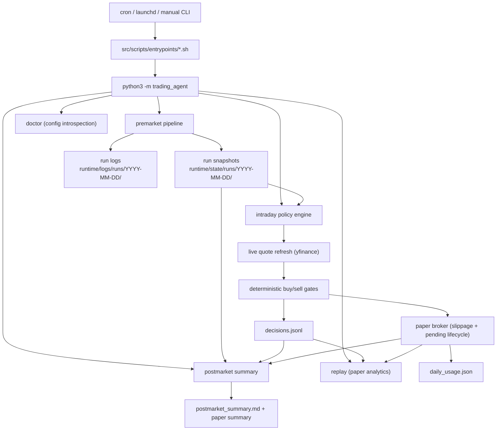

# Robinhood Codex Agent

Low-frequency trading automation for a single dedicated Robinhood Agentic Account.

The system is intentionally conservative and **fail-closed**. Premarket uses Codex (LLM) plus the
Robinhood Trading MCP to gather data and write a daily plan; everything downstream of the plan is
**deterministic Python**. Intraday never calls Robinhood MCP directly — it reads the premarket
snapshots, refreshes live quotes, runs a Python policy engine, and in paper mode updates a local
simulated account ledger.

> This is automation infrastructure, **not financial advice**. Live trading can lose money. Keep this
> in paper/review mode until the logs are boring and correct.

---

## Quick Start

```bash
# Inspect effective configuration (loads runtime.env + runtime.env.local, shows tiers/caps/layers)
python3 -m trading_agent doctor

# Lifecycle phases
python3 -m trading_agent premarket
python3 -m trading_agent intraday
python3 -m trading_agent postmarket

# Local paper-trading replay analytics (fill rate + blocked-reason distribution)
python3 -m trading_agent replay
python3 -m trading_agent replay --since 2026-06-01 --output replay.json

# Read-only dashboard + analytics DB
python3 -m trading_agent analytics build
python3 -m trading_agent dashboard

# Self-growth diagnostics (paper-only, read-only — proposes nothing, changes nothing)
python3 -m trading_agent growth observe
```

Safe-by-default state:

| Setting | Default | Meaning |
|---|---|---|
| `TRADING_MODE` | `paper` | Simulated fills only; no real orders |
| `RISK_TIER` | `3` | Live/review notional caps ($5k single / $20k daily) |
| `PAPER_RISK_TIER` | `4` | Paper-only "paper_max" tier — caps intentionally high so risk-budget binds |
| `PAPER_STARTING_CASH` | `400000` | Paper ledger seed cash |
| `CODEX_MODEL` | `gpt-5.4-mini` | Codex model for prompts |
| `KILL_SWITCH` | present | File-based hard stop for review/live intraday; paper mode may still run |

Real order placement tools are never auto-approved; review/live execution is intentionally **not
wired** in Python and fails closed with `execution_not_wired`.

---

## System Diagram



Premarket is the only phase that talks to Robinhood MCP. Intraday consumes premarket artifacts but
**must refresh execution quotes live** on each run; snapshot quotes are planner context only and are
never a valid fallback for intraday execution.

---

## Premarket DAG

```mermaid
flowchart TD
    Start["premarket start"] --> Config["load runtime config + active_watchlist"]
    Config --> Account["Codex: account_snapshot"]
    Account --> Capital["local: capital_snapshot (paper vs real)"]
    Capital --> MarketContext["local: market_context<br/>(active watchlist only, concurrent)"]

    MarketContext --> G1
    subgraph G1["parallel advisory group"]
        DSA["Codex: DSA signal scan (full universe)"]
        Kronos["local: Kronos forecast (active watchlist)"]
        Technical["Codex: technical research (active watchlist)"]
        Calendar["Codex: market calendar"]
        CoreQuotes["Codex: core quotes"]
    end

    G1 --> TraderLevels["local: trader_watch_levels"]
    TraderLevels --> CandidateMerge["local: candidate_snapshot"]
    CandidateMerge --> CandidateQuotes["local: candidate quotes"]

    CandidateQuotes --> G2
    subgraph G2["parallel candidate enrichment"]
        Tradability["local: tradability"]
        Catalysts["Codex: catalyst enrichment"]
    end

    G2 --> DataStatus["local: data_status_summary"]
    DataStatus --> Scoring["local: candidate_scores"]
    Scoring --> RiskOverlay["local: risk_overlay (tier-aware gates)"]
    RiskOverlay --> FinalPlanner["Codex: final premarket planner"]
    FinalPlanner --> Normalize["local: normalize plan_state + diagnostics"]
    Normalize --> Archive["local: archive snapshot"]
```



Advisory failures are logged and fail closed where possible. The deterministic layers (capital,
market context, trader watch levels, candidate merge, tradability, data status, scoring, risk
overlay, plan-state normalization, diagnostics, archive) own the numbers; Codex owns reasoning
(DSA classification, technical research, catalysts, account/calendar snapshots, final narrative).

---

## Active Watchlist vs Full Universe

The system separates the **full universe** (broad scan pool) from the **active watchlist** (the
symbols that receive expensive analysis):

| Layer | Pool | Why |
|---|---|---|
| DSA signal scan | full `universe.txt` (88 symbols) | Cheap classification; wide funnel |
| Kronos forecast | `active_watchlist.txt` (≤30) | Local model inference is batched but still the heaviest advisory step |
| market_feed (4 timeframes + charts) | `active_watchlist.txt` | Heavy yfinance + chart I/O |
| technical research (Codex) | `active_watchlist.txt` | Token cost |

- `src/config/active_watchlist.txt` — the curated ≤30 high-conviction symbols.
- `src/config/universe.txt` — the full 88-symbol scan pool.
- `src/config/universe_meta.json` — reference metadata for all symbols (`tier` active/watch,
  `theme`, `liquidity`).
- If `active_watchlist.txt` is absent, the system falls back to the full universe automatically.

---

## Token Optimization (DSA / Technical precompute)

Both Codex-driven signal layers used to read raw inputs (full OHLCV arrays, charts, per-symbol
fetches) and let the LLM do arithmetic the code can do exactly and far more cheaply. Two
deterministic precompute modules now run before each prompt; **the prompts' output JSON schemas
are unchanged**, so `scoring.py`, `risk_overlay.py`, and the contracts validators are unaffected —
only the *inputs* the prompts read changed.

- `planner/technical_features.py` — pure-Python (no numpy) indicator computation over the
  market_feed OHLCV already collected for the active watchlist: SMA/EMA/RSI/MACD/ATR, swing
  high/low levels, trend label, pattern flags, multi-timeframe alignment, and relative strength vs
  SPY, per symbol per timeframe (daily/weekly/hourly/intraday_15m). Daily also keeps the most
  recent `TECHNICAL_RECENT_BARS` raw candles so the LLM can still apply chan/Brooks structural
  reasoning. Written to `TECHNICAL_FEATURES_PATH` (`signals/technical_features.json`).
- `signals/dsa_metrics.py` — one batched cross-sectional yfinance download covering the full
  88-symbol universe + benchmark, producing per-symbol return/relative-strength/trend/above-SMA/
  distance-from-highs/volume-surge/ATR%/theme/liquidity, plus theme aggregates and market breadth.
  Written to `DSA_METRICS_PATH` (`signals/dsa_metrics.json`).
- Both fall back gracefully: a symbol with `data_quality="failed"` tells the prompt to fetch that
  one symbol's data itself instead of trusting the precomputed entry.
- Toggle with `ENABLE_TECHNICAL_FEATURES_PRECOMPUTE` / `ENABLE_DSA_METRICS_PRECOMPUTE` (default
  `1`); setting either to `0` reverts that layer to the old prompt-only behavior instantly.
- Full design: [`docs/design-prompt-token-optimization.md`](docs/design-prompt-token-optimization.md).

---

## Self-Growth Lab (read-only diagnostics)

The self-growth platform turns each module into a controlled
**Observe → Diagnose → Propose → Validate → Shadow Test → Compare → Recommend → Human Approve**
loop. **The full loop (G-pre + G0–G8) is implemented and is strictly paper-safe** — it diagnoses,
proposes bounded experiments, runs challengers in shadow paper against isolated ledgers, and
recommends promotions, but it changes no champion trading parameter, enables nothing automatically,
and never touches review/live. Promotion is always a manual `strategy_registry.yaml` edit by a human.

**Red line (enforced by code):** the platform can **never** auto-edit the champion strategy and
**never** auto-promote to live. The following are permanently forbidden from any mutation:
`TRADING_MODE`, `RISK_TIER`, `PAPER_RISK_TIER`, `KILL_SWITCH`, MCP approval, `place_equity_order`,
`per_trade_risk_pct`, `max_daily_risk_pct`, `max_single_stock_weight`.

The pipeline (`src/trading_agent/growth/`):

- **Safety boundary (G0)** — `src/config/growth_policy.json` + `growth/policy.py`: `mode: paper_only`,
  the allowed-mutation whitelist (per-field `min`/`max`/`max_delta`) and the forbidden-mutation
  deny-list (**union-only**: config can widen it but never weaken it). `growth/validator.py` rejects
  any forbidden field, out-of-range value, oversized delta, non-normalized weight set, or
  non-`paper_only` policy — fail-closed.
- **Observe + diagnose (G1/G2)** — `growth/observations.py` reuses the replay report + manifests to
  detect `low_trade_frequency`, `high_no_trade_rate`, `dominant_blocked_reason`,
  `high_pending_cancel_rate`, `missing_manifest`; an extensible per-module diagnoser registry
  (`growth/diagnosers/`) adds module-level findings. Surfaced read-only in the dashboard's
  "Self-Growth Lab" section.
- **Propose + validate (G3/G4)** — `growth/proposals.py` maps observations to bounded candidate
  mutations on whitelisted fields (e.g. lower `scoring.trade_threshold` by one `max_delta` step);
  every candidate passes the validator or is dropped. `growth validate` re-checks proposal files and
  writes `*_validation.json`. Output lives under `runtime/strategy_proposals/<date>/` — never applied.
- **Queue (G5)** — `growth/experiment_queue.py` + `src/config/strategy_experiments.yaml` manage the
  lifecycle `proposed → human_approved → active_shadow → ready_for_review → promoted/rejected/archived`.
  `approve` only enables shadow paper and is asserted never to switch `active_strategy`.
- **Shadow run (G-pre + G6)** — `build_experiment_paths` gives each challenger an isolated ledger
  under `runtime/state/runs/<date>/experiments/<id>/`. `growth/shadow_runner.py` re-runs the pure
  `build_risk_overlay` with the challenger's overridden threshold over the champion's persisted
  artifacts, then the pure `generate_order_intent`, writing `shadow_decisions.jsonl`. Wired into
  intraday (best-effort; a failing challenger never affects the champion).
- **Evaluate + recommend (G7)** — `growth/evaluator.py` compares champion (replay) vs challengers on
  decision-level metrics and applies `promotion_rules`; any unmet rule or unavailable metric blocks
  the recommendation. Writes `experiment_report.json` + `promotion_recommendation.md`.
- **Human promotion (G8)** — `growth promote check <id>` validates a `ready_for_review` challenger and
  drafts ready-to-paste changelog + registry entries; it **never** edits `strategy_registry.yaml`.

```bash
# 1. Build analytics, then observe + propose (diagnostics → bounded proposals; enables nothing)
python3 -m trading_agent analytics build
python3 -m trading_agent growth observe
python3 -m trading_agent growth propose
python3 -m trading_agent growth validate runtime/strategy_proposals/<date>/

# 2. A human enqueues + approves a proposal for shadow (never switches the champion)
python3 -m trading_agent growth experiments add runtime/strategy_proposals/<date>/proposal_001_*.json
python3 -m trading_agent growth experiments approve <experiment_id>

# 3. Challengers run in shadow (also runs automatically after each intraday)
python3 -m trading_agent growth shadow

# 4. Compare + recommend (recommend-only), then draft a promotion for human review
python3 -m trading_agent growth recommend
python3 -m trading_agent growth promote check <experiment_id>

# View diagnostics in the dashboard's "Self-Growth Lab" section
python3 -m trading_agent dashboard
```

Two pieces are deliberately deferred: shadow **order/equity** simulation (G6 currently produces the
decision stream only) and **forward-return attribution** (E1, blocked on accumulated paper data). The
evaluator treats both as missing metrics and therefore withholds any promote recommendation until
they exist. See [`docs/roadmap.md`](docs/roadmap.md) G phase for the full record.

---

## Risk Tiers

`src/config/risk_tiers.json` defines notional caps. The **effective tier** depends on
`TRADING_MODE`:

- `TRADING_MODE=paper` → uses `PAPER_RISK_TIER`
- `TRADING_MODE=review` / `live` → uses `RISK_TIER`

| Tier | Name | Single | Daily | Intent |
|---|---|---|---|---|
| 0 | micro_test | $10 | $25 | Initial paper/review/live micro test |
| 1 | small_live | $25 | $75 | First small live |
| 2 | moderate_live | $50 | $150 | Moderate live |
| 3 | aggressive_small_account | $5,000 | $20,000 | Small dedicated live account |
| 4 | paper_max | $100,000 | $400,000 | **Paper only** — caps intentionally high so per-trade risk-budget and portfolio-weight caps bind, not the notional hard cap |

In paper mode the binding constraints are therefore `per_trade_risk_pct` (0.5% in
`aggressive_growth`) and the portfolio-weight caps (`max_single_stock_weight`, `max_etf_weight`,
`max_theme_weight`), not the dollar notional ceiling.

Run `python3 -m trading_agent doctor` to print the effective tier and caps for the current
environment.

---

## CLI Commands

| Command | Purpose |
|---|---|
| `premarket` | Full premarket DAG → daily plan + scoring + risk overlay |
| `intraday` | Deterministic policy engine + paper broker; one decision per run |
| `postmarket` | Paper day-end + performance summary + Codex review |
| `dsa` | Standalone DSA signal scan |
| `doctor` | Print effective runtime configuration (mode, tiers, caps, layer flags) and exit |
| `replay` | Local paper-trading analytics (`--since`, `--until`, `--output`) |
| `analytics build` | (Re)build `runtime/analytics/analytics.db` from `runtime/state/runs/*` (`--since`, `--until`) |
| `dashboard` | Launch the read-only Streamlit dashboard at `http://localhost:8501` (sidebar + 7 tabs incl. Strategy Comparison: champion versions + champion-vs-challenger) |
| `growth observe` | Write read-only self-growth diagnostics to `runtime/analytics/growth_observations.json` (`--since`, `--until`) |
| `growth propose` | Write validated, whitelist-only strategy proposals to `runtime/strategy_proposals/<date>/` (never auto-enabled; `--since`, `--until`) |
| `growth validate <file\|dir>` | Validate proposal JSON(s) against `growth_policy.json`; writes sibling `*_validation.json` |
| `growth experiments list/add/approve/reject/archive` | Manage the shadow-experiment queue; `approve` only enables shadow, never switches `active_strategy` |
| `growth shadow` | Run `active_shadow` challengers over the champion's inputs into isolated ledgers (`--run-date`) |
| `growth evaluate` / `growth recommend` | Champion-vs-challenger report + promotion recommendation (recommend-only; `--since`, `--until`) |
| `growth promote check <id>` | Validate a challenger + draft changelog/registry entries; never edits `strategy_registry.yaml` |

All lifecycle commands accept `--dry-run`. Shell wrappers in `src/scripts/entrypoints/` export the
same defaults used by cron/launchd and are the canonical operational path.

---

## Package Architecture

```text
src/trading_agent/
  cli.py                   argparse entrypoint: premarket/intraday/postmarket/dsa/doctor/replay/
                           analytics/dashboard/growth
  core/                    runtime config + env loading, paths, time, JSON helpers, run logs, locks
  orchestration/           lifecycle pipelines (premarket / intraday / postmarket / tasks)
  prompts/                 Codex subprocess runner and runtime variable block
  data/                    yfinance market context (concurrent), live quotes, charts, universe
  signals/                 DSA scan, Kronos payloads, technical fallback + levels
  planner/                 deterministic candidate snapshot, scoring, risk overlay, diagnostics
  policy/                  deterministic intraday engine: ranking, price, sizing, sell, risk
  paper/                   local paper broker (slippage, pending fills, day-end cancel)
  replay/                  paper-trading analytics (fill rate, blocked reasons)
  strategy/                run_manifest + strategy_registry (traceability for every run)
  analytics/               analytics.db builder (SQLite) over runtime/state/runs/*
  dashboard/               read-only Streamlit console (queries + charts + app)
  growth/                  self-growth platform (G0-G8): policy/validator, observations/diagnosers,
                           proposals, experiment queue, shadow runner, evaluator, promotion check
  reporting/               premarket archive, postmarket reports, watch-level normalization
  notifications/           email notifications
  contracts/               schema validators for generated payloads
```

Shell wrappers live in `src/scripts/`. They source `src/scripts/lib/common.sh`, load
`src/config/runtime.env` plus optional `src/config/runtime.env.local`, create dated runtime folders,
and call the Python package. The Python entrypoint **also** loads those env files itself (via
`core/config.py`), so `python3 -m trading_agent` and the shell wrappers produce the same effective
config. Shell exports always win over file values; `runtime.env.local` overrides `runtime.env`.

---

## Configuration (`src/config/`)

```text
runtime.env                 default mode, model, tier, layer flags, paper settings
runtime.env.local           local overrides, ignored by git
runtime.env.local.example   override template
risk_tiers.json             notional caps by tier (0-4)
policy_profiles.json        deterministic intraday policy profiles (conservative / aggressive_growth)
scoring_profiles.yaml       premarket watchlist/trade/coverage thresholds by profile
universe.txt                full 88-symbol scan pool
active_watchlist.txt        ≤30 symbols that get Kronos + market_feed + technical
universe_meta.json          per-symbol reference metadata (tier/theme/liquidity)
allowlist.txt               emergency fallback symbols
dsa_strategy_weights.json   DSA-inspired signal weights
strategy_registry.yaml      registered strategy versions + active_strategy pointer (B2)
growth_policy.json          self-growth safety boundary: allowed/forbidden mutations, ranges, promotion rules (G0)
risk.md                     human-readable hard risk rules
strategy.md                 trading and screening strategy
```

Key env knobs (see `runtime.env`):

```bash
TRADING_MODE=paper
RISK_TIER=3                 # live/review
PAPER_RISK_TIER=4           # paper-only
PAPER_STARTING_CASH=400000
ENABLE_DSA_SIGNAL_LAYER=1
ENABLE_KRONOS_SIGNAL_LAYER=1
ENABLE_MARKET_FEED_LAYER=1
ENABLE_TECHNICAL_SIGNAL_LAYER=1
DSA_MAX_SUBAGENTS=3
TECHNICAL_MAX_SUBAGENTS=3
MARKET_FEED_TIMEFRAMES=1w,1d,1h,15m
MARKET_FEED_MAX_WORKERS=4   # market_context concurrency
PAPER_FILL_MODEL=conservative
PAPER_SLIPPAGE_BPS=10       # 0.1% slippage on paper fills
PAPER_CANCEL_PENDING_AT_DAY_END=1

# Token optimization: precompute indicators/metrics in Python so prompts read a compact
# feature pack instead of raw charts/OHLCV/per-symbol fetches. Output schemas are unchanged;
# set either flag to 0 to roll back to the old prompt-only behavior instantly.
ENABLE_TECHNICAL_FEATURES_PRECOMPUTE=1
TECHNICAL_RECENT_BARS=30            # daily candles included verbatim in the feature pack
ENABLE_DSA_METRICS_PRECOMPUTE=1
DSA_METRICS_LOOKBACK_DAYS=180       # yfinance lookback window for the cross-sectional table
```

---

## Lifecycle

### Premarket

```bash
python3 -m trading_agent premarket
./src/scripts/entrypoints/run_premarket.sh   # canonical: exports cron/launchd defaults + Kronos paths
```

Steps:

1. Load runtime config and active watchlist.
2. Codex `account_snapshot` → `planner/account_snapshot.json`.
3. Local `capital_snapshot` separating paper sizing cash from real Robinhood buying power.
4. Local `market_context` (active watchlist only, concurrent yfinance fetch + charts) → `market_feed/`.
5. Parallel advisory layers: DSA scan (full universe), Kronos forecast (active), technical research
   (active, may fan out to `TECHNICAL_MAX_SUBAGENTS` read-only subagents), market calendar, core quotes.
   Before the DSA and technical prompts run, Python precomputes their numeric inputs so the Codex
   layer reads a compact feature pack instead of raw OHLCV/charts or per-symbol fetches (see
   **Token Optimization** below).
6. Local `trader_watch_levels` (schema normalization of technical levels).
7. Local `candidate_snapshot` from holdings + open orders + advisory signals.
8. Local candidate quote snapshot, then parallel tradability + catalyst enrichment.
9. Local `data_status_summary` with structured reason codes.
10. Local `candidate_scores` (weighted aggregation) and `risk_overlay` (tier-aware gates).
11. Codex final planner writes `daily_plan.*`, `today_allowlist.txt`, `dynamic_allowlist.json`,
    reset `daily_usage.json`.
12. Local normalize of `daily_plan.plan_state` from `risk_overlay`, then `premarket_diagnostics.json`.
13. Local archive snapshot.

**Scoring** aggregates existing layer outputs with transparent weights (DSA 0.25, technical 0.30,
Kronos 0.15, quote 0.10, catalyst 0.20), normalized by effective coverage so missing optional
components don't drag a symbol bearish. Thresholds come from `scoring_profiles.yaml` (default
`aggressive_growth`: watchlist 35, trade 50, high-conviction 80, min coverage 0.5).

`daily_plan.plan_state`:
- `no_trade` — a real market/account/capital/data blocker, or zero scored candidates.
- `observe_only` — watchlist candidates exist but none currently tradable (keeps `today_watchlist`,
  `allowed_actions=[]`).
- `trade_ready` — at least one candidate clears the trade threshold and global gates are open.

Layer flags & manual runs:

```bash
ENABLE_KRONOS_SIGNAL_LAYER=0 ./src/scripts/entrypoints/run_premarket.sh
./src/scripts/entrypoints/run_dsa_premarket_scan.sh
./src/scripts/data/run_market_feed_collection.sh
./src/scripts/kronos/run_kronos_premarket_scan.sh
```

### Intraday

```bash
python3 -m trading_agent intraday
./src/scripts/entrypoints/run_intraday.sh
```

Deterministic Python policy path — **no direct Robinhood MCP calls**:

1. Skip on weekends unless `ALLOW_WEEKEND_RUN=1`.
2. Skip outside 06:45–12:55 PT unless `ALLOW_OUTSIDE_MARKET_TEST=1`.
3. Skip when `KILL_SWITCH` exists for `review/live` unless `ALLOW_KILL_SWITCH_PAPER_TEST=1`. Paper mode may still run.
4. Load runtime mode + effective risk tier.
5. Load policy inputs from config, planner files, signals, account snapshot.
6. **Refresh live quotes** (yfinance) for watchlist + allowlist + positions + open orders only
   (no longer the full universe).
7. Paper mode: reconcile pending paper orders against fresh quotes, then overlay paper cash/positions.
8. Run deterministic **sell-first then buy** policy.
9. Append exactly one decision to `decisions.jsonl`.

**Quote rules:** intraday uses only live quotes. If a quote is missing/unparsable → `missing_quote`;
if older than `MAX_QUOTE_AGE_SECONDS` (default 600) → `stale_quote`. It never falls back to premarket
snapshot quotes.

**Buy ranking** (`policy/candidate_selector.py`) — `trade_readiness_score`, weights sum to 1.00:

```
0.35 * candidate_total      (premarket aggregate score)
0.25 * technical_score
0.15 * price_setup_score     ← live setup quality (entry-zone/breakout + reward:risk); pending calibration
0.10 * liquidity_score
0.10 * research_score
0.05 * catalyst_score
```

`price_setup_score` (`policy/technical.py:estimate_price_setup_score`) is computed at ranking time
from current quote + watch levels: no-trade-zone/chase → 0, outside zone → 20, breakout → 60+RR
bonus, pullback in entry zone → 70+RR bonus.

**Buy gating:** requires intersection of `universe.txt` ∩ `today_allowlist.txt` ∩
`daily_plan.today_watchlist`; score ≥ threshold; fresh quote; no open order; no average-down into a
loser; daily/single-order cap room; buying power; valid technical entry; reward:risk ≥
`min_reward_risk`. Hard-blocks also on `KILL_SWITCH`, stale plan, `execution_blocking`, and
`market_regime in {no_trade, risk_off}`.

**Sizing** (`policy/sizing_policy.py`) uses risk-budget (`per_trade_risk_pct` × portfolio equity ÷
stop distance), then caps by single-order, daily-remaining, cash buffer, and per-stock / per-ETF /
per-theme weight limits, then applies score × market × research multipliers.

**Low-frequency controls:** `cooldown_days_after_buy`, `cooldown_days_after_stop`,
`max_new_positions_per_day`, `max_new_positions_per_week`.

### Paper Mode

The active execution simulation path. On `would_trade`,
`trading_agent.paper.broker.apply_paper_intent()`:

- Uses `PAPER_FILL_MODEL` (default `conservative`): a buy fills only when current price ≤ limit; a
  sell fills only when current price ≥ limit; otherwise it's logged **pending**.
- Applies **slippage** (`PAPER_SLIPPAGE_BPS`, default 10 = 0.1%): buy fill =
  `min(limit, ref×(1+slip))`, sell fill = `max(limit, ref×(1-slip))`. All accounting uses the fill
  price, not the limit.
- Buys reduce `paper/account.json` cash and update weighted average cost in `paper/positions.json`;
  sells require an existing position, increase cash, reduce/remove position, update realized PnL.
- Pending orders are reconciled on later intraday runs against fresh quotes; unfilled pending orders
  are canceled at day-end when `PAPER_CANCEL_PENDING_AT_DAY_END=1` (default).
- Every submission appends to `paper/orders.jsonl`; fills append to `paper/equity_curve.jsonl`.
- Only filled orders update `daily_usage.json` (used/filled notional, order count, per-symbol
  buy/sell/stop dates, new-position counters).

### Review / Live

Intentionally **not wired**. `TRADING_MODE=review` or `live` may produce an order intent but returns
`blocked` with `execution_not_wired`. `review_equity_order` and `place_equity_order` are never called
by intraday Python.

### Postmarket

```bash
python3 -m trading_agent postmarket
./src/scripts/entrypoints/run_postmarket.sh
```

Paper mode: writes `paper/day_end.json`, `paper/postmarket_summary.json` (start/end equity, cash
change, realized PnL, filled notional, order counts, open positions), and a Chinese
`postmarket_summary.md`. Then runs the Codex review prompt for reconciliation and rule-violation
detection.

### Replay (paper analytics)

```bash
python3 -m trading_agent replay
python3 -m trading_agent replay --since 2026-06-01 --until 2026-06-15
python3 -m trading_agent replay --output replay.json
```

Locally computes, across all (or filtered) run dates:

- **Fill rate** — filled / pending / canceled / rejected counts, fill-rate %, notional totals,
  per-symbol breakdown. Merges per-order event streams (submission → `pending_filled` /
  `day_end_cancel`) into a final status per order.
- **Blocked-reason distribution** — would-trade vs no-trade split and ranked counts of every
  `blocked_reason` across intraday evaluations.

Score-bucket vs forward-return analysis is **not yet implemented** (needs multiple run dates of
accumulated data — see `docs/roadmap.md`).

---

## Runtime State & Logs

Each run date uses the same shape (all git-ignored):

```text
runtime/state/runs/YYYY-MM-DD/
  market_feed/   manifest.json, charts/, ohlcv/, news/
  signals/       dsa_signals.json, kronos_signals.json, technical_signals.json,
                 technical_signals.full.json (premarket-owned full-day snapshot; intraday reads
                 merge(snapshot, live) so an ad hoc single-symbol technical run can't drop the
                 watchlist), dsa_metrics.json, technical_features.json
  planner/       account_snapshot, capital_snapshot, market_calendar, quote_snapshot_core,
                 candidate_snapshot, candidate_scores, quote_snapshot_candidates,
                 tradability_snapshot, catalyst_snapshot, trader_watch_levels,
                 data_status_summary, risk_overlay, premarket_diagnostics,
                 today_allowlist.txt, dynamic_allowlist.json,
                 daily_plan.json/.md/.zh.md, daily_usage.json
  paper/         account.json, positions.json, orders.jsonl, day_start.json, day_end.json,
                 equity_curve.jsonl, postmarket_summary.json
  archive/       premarket_report.json

runtime/logs/runs/YYYY-MM-DD/
  pipeline/      pipeline.jsonl
  progress/      *.jsonl
  outputs/       codex_runs.log, stdout/*.log, stderr/*.log
  system/        errors.log
  audit/         decisions.jsonl, orders.jsonl
  reports/       postmarket_summary.md
```

Generated state and logs are git-ignored because they contain account size, decisions, symbols, and
timestamps. Machine-specific values belong in `src/config/runtime.env.local` (also ignored).

---

## Safety Model

Hard rules:

- only the dedicated Robinhood Agentic Account
- long equities/ETFs only — no options, crypto, futures, margin, shorts, leveraged/inverse ETFs
- limit orders only
- notional capped by effective risk tier and daily plan
- missing/stale/inconsistent data → do nothing
- `KILL_SWITCH` present → intraday blocked for review/live; paper mode may still run
- DSA / Kronos / technical signals are advisory only
- intraday never calls Robinhood MCP directly
- real execution remains unwired in Python policy

MCP approval policy: Robinhood read tools auto-approved for scheduled prompts; `review_equity_order`
may be auto-approved for future review simulation; `place_equity_order`, cancellation, option, and
watchlist-write tools remain prompt-gated.

```bash
./src/scripts/safety/check_safety.sh
```

---

## Setup

```bash
# Codex + Robinhood MCP
codex login
codex mcp add robinhood-trading --url https://agent.robinhood.com/mcp/trading
codex
/mcp        # complete Robinhood Agentic Account auth on desktop

# Repo-owned trading skills
./src/scripts/skills/install_repo_skills.sh
./src/scripts/skills/verify_repo_skills.sh

# Portable Kronos (needs git + Python 3.11/3.12)
KRONOS_BOOTSTRAP_PYTHON=$(command -v python3.12) ./src/scripts/kronos/setup_kronos_env.sh
./src/scripts/kronos/verify_kronos_env.sh
```

Default Kronos model `NeoQuasar/Kronos-base`, tokenizer `NeoQuasar/Kronos-Tokenizer-base`,
`KRONOS_LOOKBACK_BARS=512`. The setup script prefers `python3.12`, then `python3.11`.
Live Kronos generation uses upstream `KronosPredictor.predict_batch()` grouped by historical
window length, so normal active-watchlist runs make one local inference call per window-length
group instead of one call per symbol. If the installed Kronos build lacks batch support or a batch
call fails, the generator automatically falls back to per-symbol `predict()` for that group.

Portable rebuild and validation flow:

```bash
git clone <repo-url>
cd trading
find src/scripts -name '*.sh' -exec chmod +x {} +
KRONOS_BOOTSTRAP_PYTHON=$(command -v python3.12) ./src/scripts/kronos/setup_kronos_env.sh
./src/scripts/kronos/verify_kronos_env.sh
./src/scripts/safety/check_safety.sh
ALLOW_WEEKEND_RUN=1 KRONOS_USE_MOCK=1 ./src/scripts/kronos/run_kronos_premarket_scan.sh
ALLOW_WEEKEND_RUN=1 CODEX_EXEC_DRY_RUN=1 ./src/scripts/entrypoints/run_premarket.sh
```

Repo-owned skills (advisory context for technical research; cannot authorize trades):
`chan-structure-trading`, `brooks-trading-range-price-action`, `equity-fundamentals-analysis`,
`trading-research-casebook-maintenance`.

---

## Dry Run & Tests

```bash
# Dry-run shell wrappers without invoking Codex
CODEX_EXEC_DRY_RUN=1 ./src/scripts/entrypoints/run_premarket.sh

# Full paper lifecycle locally (moves KILL_SWITCH aside, restores after)
ALLOW_OUTSIDE_MARKET_TEST=1 ./src/scripts/entrypoints/run_all_paper_once.sh

# Portable rebuild + validation
./src/scripts/kronos/setup_kronos_env.sh && ./src/scripts/kronos/verify_kronos_env.sh
./src/scripts/safety/check_safety.sh
ALLOW_WEEKEND_RUN=1 KRONOS_USE_MOCK=1 ./src/scripts/kronos/run_kronos_premarket_scan.sh

# Unit tests
python3 -m pytest tests/ -q
python3 -m unittest discover -s tests -v
```

---

## Schedule

America/Los_Angeles:

- `05:30` premarket research
- `06:45` first intraday check, then every 30 min until `12:45`
- `13:10` postmarket summary

Use `cron.example` or `launchd/*.plist.example` after replacing `__REPO_ROOT__` with your local
path.

---

## Rollout

1. Paper only: inspect `would_trade` / `paper_fill` / `paper_pending` / `blocked` decisions.
2. Paper with repeated intraday runs: confirm paper ledger + `daily_usage.json` + pending
   reconciliation. Use `replay` to check fill rate and blocked-reason distribution.
3. Review mode: wire `review_equity_order` only after tests prove the path stays non-placing.
4. Live tier 0: add live execution only after clean review logs and a human removes `KILL_SWITCH`.
5. Raise tiers manually only after clean postmarket summaries.

Never let Codex edit `RISK_TIER` itself. Postmarket may *recommend* a change; a human makes it.

---

## Project Docs

- `docs/project-status.md` — complete, block-by-block account of what is built and what is not.
- `docs/roadmap.md` — detailed prioritized checklist of remaining work.
- `docs/setup/` — setup notes. `docs/superpowers/` — design specs and plans.
